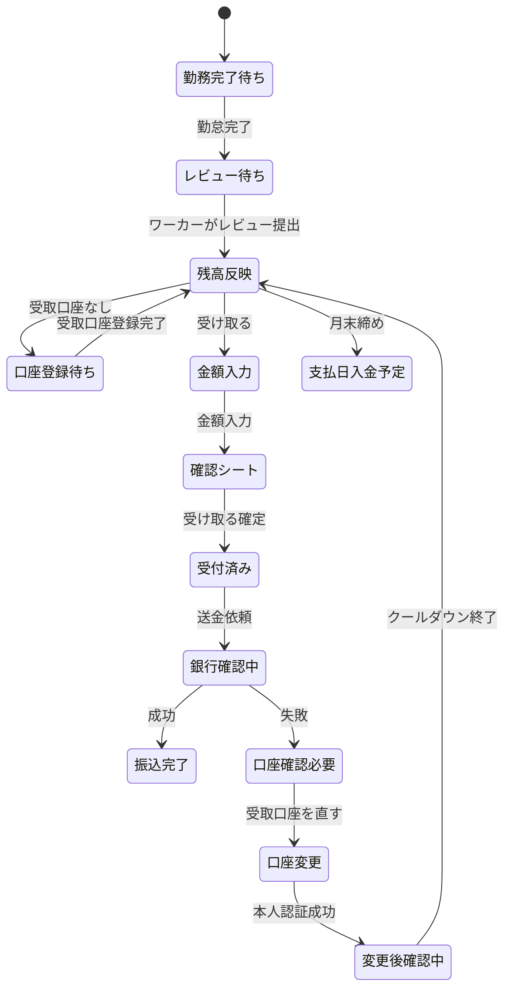
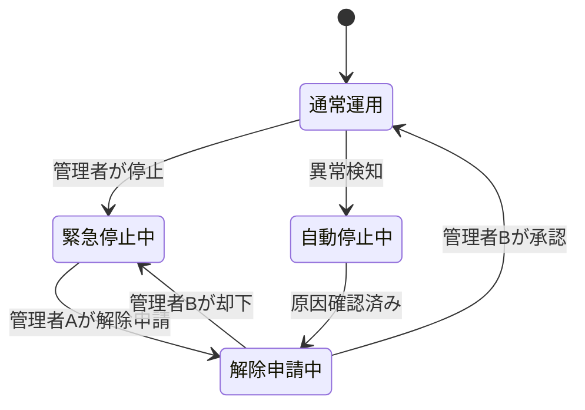
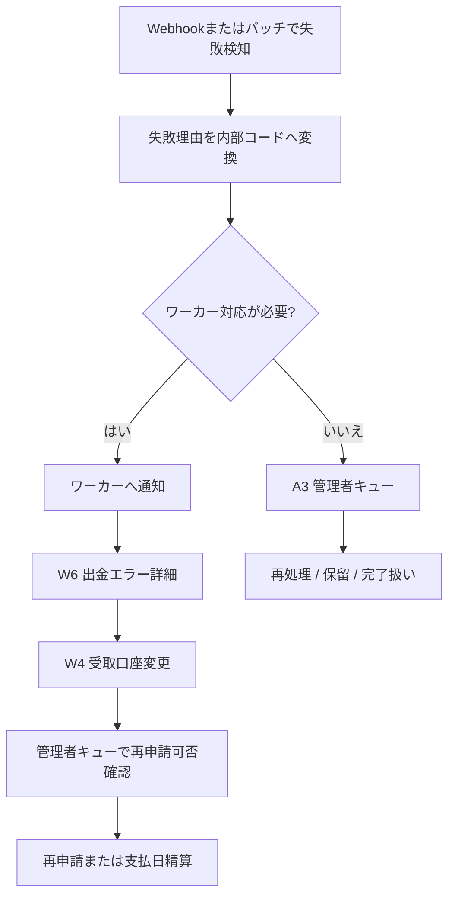
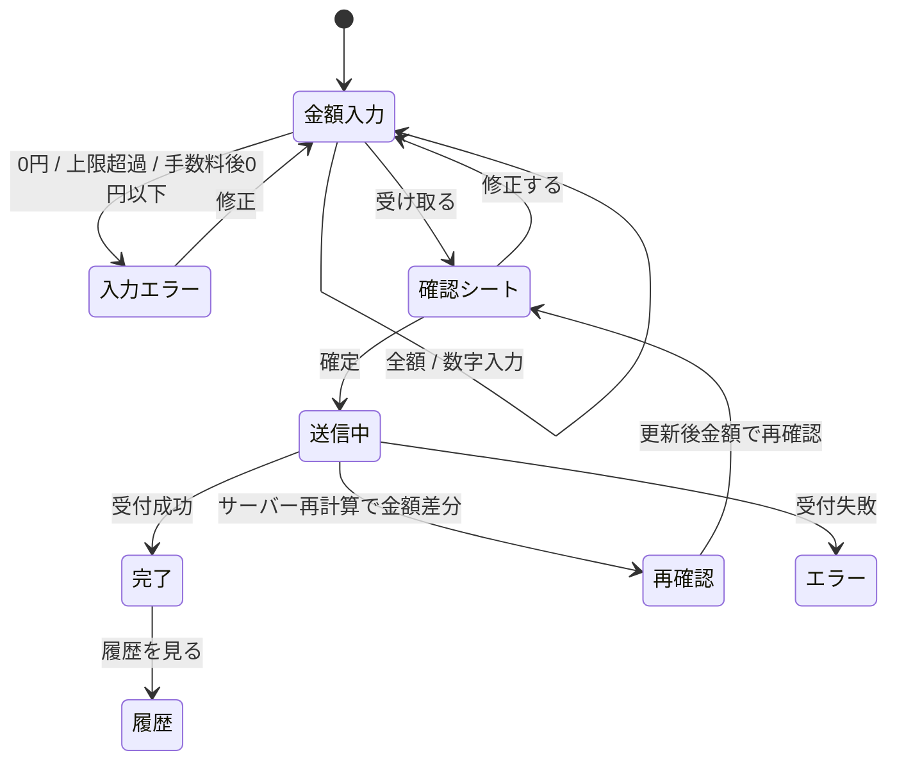
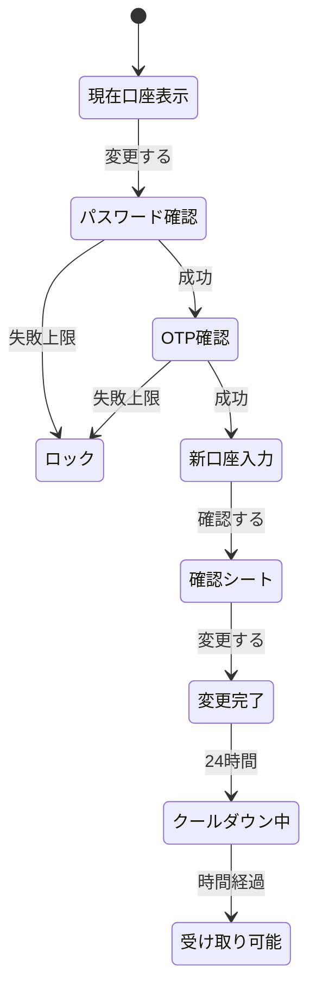
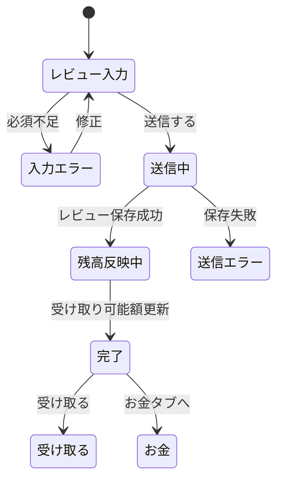
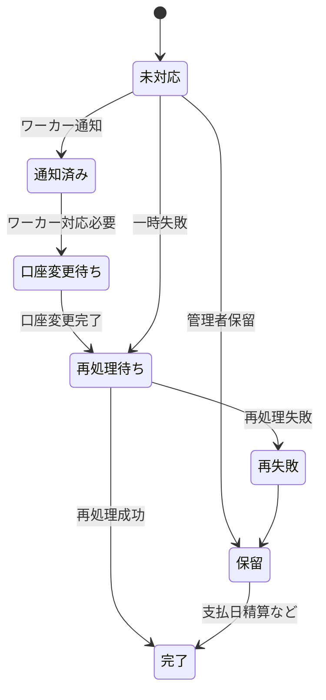

# 日払い機能 画面仕様書ドラフト

> 作成日: 2026-05-27  
> 対象: ワーカー側・システム管理者側の日払い画面  
> ステータス: ドラフト（実装着手前レビュー用）  
> 対象プロジェクト: Next.js 14 App Router + TypeScript + Tailwind + Prisma + Supabase

---

## 1. 目的とスコープ

### 1.1 目的

看護師・介護士ワーカーが、勤務完了後に「今すぐ受け取れる金額」を直感的に確認し、最短ステップで「受け取る」操作を完了できる画面仕様を定義する。管理者側では、前払い状況の監視、緊急停止、出金エラー対応、ワーカー別設定、履歴出力、監査ログ確認を実装できる粒度で定義する。

### 1.2 対象画面

| 区分 | ID | 画面名 | 想定URL |
|---|---:|---|---|
| ワーカー | W1 | お金タブ（残高ホーム） | `/money` |
| ワーカー | W2 | 受け取る（金額入力 → 確認シート → 完了） | `/money/receive` |
| ワーカー | W3 | 受取口座 登録 | `/money/bank-account/new` |
| ワーカー | W4 | 受取口座 変更（本人認証含む） | `/money/bank-account/edit` |
| ワーカー | W5 | 引き出し履歴 | `/money/history` |
| ワーカー | W6 | 出金エラー詳細 | `/money/withdrawals/[withdrawalId]/error` |
| ワーカー | W7 | レビュー提出（前払い解放トリガー） | `/mypage/reviews/[applicationId]` |
| ワーカー | W8 | 残高内訳・FAQ | `/money/breakdown` |
| 管理者 | A1 | 前払いダッシュボード | `/system-admin/hibarai` |
| 管理者 | A2 | 緊急一括停止 | `/system-admin/hibarai/emergency-stop` |
| 管理者 | A3 | 出金エラー対応キュー | `/system-admin/hibarai/errors` |
| 管理者 | A4 | ワーカー別 前払い設定 | `/system-admin/hibarai/workers/[workerId]/settings` |
| 管理者 | A5 | 引き出し履歴・CSV出力 | `/system-admin/hibarai/withdrawals` |
| 管理者 | A6 | ポリシー変更履歴（監査ログ） | `/system-admin/hibarai/audit-logs` |

### 1.3 非対象

| 項目 | 方針 |
|---|---|
| 施設側画面 | 作成しない。前払い実行有無は施設側には非表示。 |
| 実装コード | 本書では記載しない。 |
| SQL | 本書では記載しない。 |
| 法務・会計の最終判断 | 未確定事項として管理し、画面上は曖昧な用語を避ける。 |

### 1.4 参照資料

| 資料 | 反映方針 |
|---|---|
| `docs/hibarai/2026-5-7.md` | 勤怠完了 + レビュー提出、9割/7割、月末、口座変更、緊急停止、履歴保持の論点を反映 |
| `docs/hibarai/review-architect-logic.md` | 算定母数・二重払い・月跨ぎ・過払い・キャリ払い差分を未確定事項と画面注意に反映 |
| `docs/hibarai/review-ux-flow.md` | PayPay系の直感性、Before/Afterコピー、3ステップ受け取り、口座分離、エラー安心導線を反映 |
| `docs/hibarai/review-security.md` | 口座変更クールダウン、サーバー側再計算、冪等性、Webhook検証、管理者MFA、二者承認、監査ログを反映 |
| `docs/system-design.md` | ファイル未存在のため参照不可。既存実装 `app/mypage/`, `app/system-admin/` のUIパターンを優先 |

---

## 2. 共通設計方針

### 2.1 固定用語

| 固定用語 | 用途 | 使用しない表現 |
|---|---|---|
| 今すぐ受け取れる金額 | ワーカーが今日受け取れる上限 | 前払い可能額、プール、チャージ |
| 支払日に入る金額 | 各案件の既存の報酬支払日に振り込まれる見込み | 残り、保留分、1割分 |
| 受け取る | ワーカーの出金アクション | 前払い申請、引き出し申請 |
| 受取口座 | ワーカーの振込先口座 | 振込先口座、銀行口座 |

### 2.2 UXコピー

| Before | After（採用コピー） | 使用箇所 |
|---|---|---|
| 前払い申請 | 受け取る | W1, W2 |
| 前払い可能額 | 今すぐ受け取れる金額 | W1, W2, W8 |
| レビュー未提出のため対象外 | レビューすると ¥8,640 受け取れます | W1, W7 |
| 振込エラー | 口座を確認できませんでした | W1, W6 |
| 口座修正を促す | 受取口座を直してください | W6 |
| 手数料100〜200円本人負担 | 手数料 ¥143 を引いて振り込みます | W2 |
| 1円単位で引き出し可能 | 1円から受け取れます | W2, W8 |
| 月末締め | 5/31 23:59まで受け取りできます | W1, W8 |
| 前払い率7割 | 一部は支払日に入ります | W8 |
| レビューを投稿してください | 30秒レビューで受け取りできます | W1, W7 |
| 投稿中... | 送信しています | W7 |
| その口座では再引き出し不可 | この口座では受け取れません。別の口座を登録してください | W6 |

### 2.3 既存UIパターンへの合わせ込み

| 領域 | 既存パターン | 本機能での適用 |
|---|---|---|
| ワーカー画面 | `min-h-screen bg-gray-50 pb-24`, 白カード、stickyヘッダー、下部余白 | `/money` 配下でも同様。本文16px以上、金額は36〜44px |
| ワーカー一覧/空状態 | `EmptyState`、カードリスト、`lucide-react` アイコン | 履歴なし、口座未登録、レビュー対象なしで使用 |
| ワーカー入力 | 大きめフォーム、`toast`、エラー時の赤枠 | 口座入力、金額入力、レビューで使用 |
| 管理者画面 | `p-8 max-w-[1600px]`, 検索フォーム、フィルター、テーブル、カード | A1〜A6で使用 |
| 管理者ローディング | `SystemAdminLoading` 相当のスケルトン | A1〜A6で使用 |
| アイコン | `lucide-react` | `Wallet`, `Banknote`, `ShieldCheck`, `AlertTriangle`, `Download`, `History` など |

### 2.4 アクセシビリティ共通要件

| 項目 | 要件 |
|---|---|
| 本文サイズ | 16px以上。補足文は14pxまで可だが、重要情報は16px以上 |
| タップ領域 | ワーカー画面は44px以上、主要ボタンは56px推奨 |
| コントラスト | テキストと背景は4.5:1以上 |
| 状態表現 | 赤・黄・緑だけに依存せず、アイコンと文言を併用 |
| 金額入力 | 数字キーボード、全額ボタン、入力値読み上げに対応 |
| フォーカス | モーダル・ボトムシートはフォーカストラップ、Esc/閉じる導線 |
| 読み上げ | 金額は `12,480円` と読めるラベルを付与 |
| 動き | カウントアップや完了演出は `prefers-reduced-motion` で抑制 |

### 2.5 セキュリティ共通要件

| 領域 | 要件 |
|---|---|
| 金額計算 | クライアント値を信用しない。表示・確認・実行時にサーバー側で再計算し、差分があれば確認へ戻す |
| 認可 | `workerId`, `attendanceId`, `withdrawalId` はセッション主体から検証。IDOR/BOLAを防ぐ |
| 送金 | 同一勤怠・同一支払期間・同一ワーカーの二重送金を防ぐ。送金処理は冪等キー必須 |
| 口座情報 | 画面表示は銀行名・支店名・末尾4桁のみ。ログ・通知にもフル口座番号を出さない |
| 口座変更 | 現在パスワード再入力 + SMSまたはメールOTP。変更後24時間は原則出金停止 |
| 新端末/新IP | 口座変更や高額出金時は追加確認。必要に応じ72時間少額制限 |
| Webhook | GMO等の振込結果通知は署名検証。生レスポンスはワーカーへ表示しない |
| 管理者 | MFA必須。停止は単独可、解除・上限変更・手動再処理は二者承認 |
| 監査ログ | 送金・口座・設定・停止操作はappend-onlyで最低5年保持 |

### 2.6 共通ステータス

| 種別 | ステータス | ワーカー向け表示 | 管理者向け表示 |
|---|---|---|---|
| 残高 | `available` | 受け取れます | 利用可能 |
| 残高 | `locked_by_review` | 30秒レビューで受け取りできます | レビュー未提出 |
| 残高 | `month_closed` | 支払日に入ります | 月次締め済み |
| 残高 | `global_stopped` | ただいま受け取りを停止しています | 緊急停止中 |
| 口座 | `unregistered` | 受取口座を登録してください | 未登録 |
| 口座 | `verified` | 登録済み | 登録済み |
| 口座 | `cooldown` | 変更後の確認中です | 変更後クールダウン |
| 口座 | `blocked` | この口座では受け取れません | 口座ブロック |
| 出金 | `draft` | 入力中 | 下書き |
| 出金 | `accepted` | 受け取り申請できました | 受付済み |
| 出金 | `bank_processing` | 銀行確認中 | 銀行処理中 |
| 出金 | `completed` | 振込完了 | 完了 |
| 出金 | `failed` | 口座を確認できませんでした | 失敗 |
| 出金 | `cancelled` | キャンセルされました | キャンセル |

---

## 3. 全体状態遷移

### 3.1 ワーカー側: 残高発生から受け取り完了まで

### 3.2 管理者側: 緊急停止と解除

### 3.3 出金エラー対応

---

## 4. ワーカー側 共通レイアウト

| 項目 | 仕様 |
|---|---|
| 表示端末 | スマートフォン優先。PCは中央幅最大640pxのモバイルUI |
| ヘッダー | 白背景、左戻るまたは画面タイトル、必要時のみ右ヘルプ |
| 下部タブ | `探す / 仕事 / お金 / メッセージ / マイページ`。W1は `お金` をアクティブ |
| 主ボタン | 赤系または既存 `primary`。ラベルは原則1つの動詞 |
| カード | 白背景、角丸8px前後、過度な装飾なし |
| エラー | 不安を煽らず、原因の一般表現 + 次の操作を提示 |
| 通知導線 | エラー・レビュー解放・口座未登録はW1上部カードへ集約 |

---

## 5. 管理者側 共通レイアウト

| 項目 | 仕様 |
|---|---|
| 表示端末 | PC優先、最小幅1024px想定 |
| ページ幅 | `max-w-[1600px] mx-auto p-8` 相当 |
| 上部 | 画面タイトル、説明、主要アクション |
| 指標 | 4列カード、重要アラートは左上または上部固定 |
| 一覧 | 検索、詳細フィルター、ソート、ページネーション |
| 操作 | 危険操作は確認モーダル。解除・上限変更は二者承認状態を表示 |
| デバッグ | 管理者向け内部コードは表示可。ただし秘密情報・GMO生レスポンスは不可 |

---

## 6. ワーカー側画面仕様

## W1. お金タブ（残高ホーム）

### W1-1. 画面名・URL

| 項目 | 内容 |
|---|---|
| 画面名 | お金 |
| URL | `/money` |
| App Router | `app/money/page.tsx` 想定 |
| 主タスク | 今すぐ受け取れる金額を確認し、受け取る操作へ進む |

### W1-2. アクセス権限・前提条件

| 項目 | 仕様 |
|---|---|
| 権限 | ログイン済みワーカー |
| 前提 | ワーカー本人の残高・履歴・受取口座のみ表示 |
| 未ログイン | `/login?redirect=/money` へ誘導 |
| グローバル停止中 | 残高表示は可能、受け取るボタンは無効化 |

### W1-3. 画面要素一覧

| コンポーネント | 状態 | props案 | 表示・挙動 |
|---|---|---|---|
| `WorkerMoneyHeader` | default | `title="お金"` | stickyヘッダー。右にFAQアイコン |
| `AvailableBalanceCard` | `available / zero / stopped / cooldown` | `availableAmount`, `deadlineText`, `canReceive`, `disabledReason` | 「今すぐ受け取れる金額」と大きな金額を表示。主ボタンは「受け取る」 |
| `ScheduledPaymentAmountSummary` | default | `scheduledPaymentAmount`, `scheduledPaymentDate` | 「支払日に入る金額」を小さく表示。W8へ遷移 |
| `ReviewUnlockCard` | `visible / hidden` | `items[]`, `totalUnlockAmount` | 「レビューすると ¥8,640 受け取れます」。W7へ遷移 |
| `BankAccountCard` | `registered / unregistered / cooldown / blocked` | `bankName`, `branchName`, `last4`, `status` | 未登録なら「受取口座を登録」。登録済みは変更導線 |
| `LatestHistoryList` | `hasItems / empty / hasError` | `historyItems[3]` | 直近3件。W5へ遷移 |
| `ErrorRecoveryBanner` | `visible / hidden` | `withdrawalId`, `message`, `supportCode` | 「口座を確認できませんでした」。W6へ遷移 |
| `BottomTabNav` | default | `active="money"` | `お金` タブをアクティブ表示 |

### W1-4. インタラクション・状態遷移

| 操作 | 条件 | 遷移・結果 |
|---|---|---|
| 「受け取る」タップ | `availableAmount > 0` かつ口座登録済み | W2 `/money/receive` |
| 「受け取る」タップ | 受取口座未登録 | W3 `/money/bank-account/new?redirect=/money/receive` |
| 「受け取る」タップ | 口座変更後クールダウン | ボタン無効。理由「受取口座の確認中です」を表示 |
| 「30秒レビュー」タップ | レビュー未提出勤務あり | W7 `/mypage/reviews/[applicationId]?source=money` |
| 受取口座カードタップ | 口座あり | W4 `/money/bank-account/edit` |
| 履歴行タップ | 履歴あり | W5またはW6へ遷移 |
| 残高内訳タップ | 常時 | W8 `/money/breakdown` |

### W1-5. エラー・空・ローディング状態

| 状態 | 表示 |
|---|---|
| loading | 金額カード・口座カード・履歴3行のスケルトン |
| empty | `今すぐ受け取れる金額 ¥0`、補足「勤務完了後、30秒レビューで受け取りできます」 |
| error | 残高取得失敗時は「金額を読み込めませんでした」。再読み込みボタン |
| success | 金額を表示。残高反映直後は軽いカウントアップ |

### W1-6. アクセシビリティ要件

| 項目 | 要件 |
|---|---|
| 金額 | 視覚表示は36〜44px。読み上げは「今すぐ受け取れる金額、12,480円」 |
| ボタン | 高さ56px、横幅100%。無効時も理由テキストを近接表示 |
| 履歴 | ステータスチップはアイコン + 文言 |
| カウントアップ | 動きが苦手な設定では即時表示 |

### W1-7. セキュリティ要件

| 項目 | 要件 |
|---|---|
| 残高 | サーバー側で本人セッションに紐づく残高のみ返す |
| 金額 | クライアントで表示された金額は送金根拠にしない |
| 履歴 | 他ワーカーの `withdrawalId` を指定しても表示不可 |
| 口座 | 口座番号は末尾4桁のみ |
| 停止中 | 緊急停止中は受け取り操作を完全に無効化 |

### W1-8. アナリティクスイベント案

| イベント | 発火タイミング | 主な属性 |
|---|---|---|
| `money_home_viewed` | 画面表示 | `available_amount_bucket`, `has_bank_account`, `has_review_unlock`, `global_stop` |
| `receive_cta_clicked` | 受け取るタップ | `available_amount_bucket`, `account_status` |
| `review_unlock_card_clicked` | レビューカードタップ | `unlock_amount_bucket`, `application_id_hash` |
| `bank_account_card_clicked` | 口座カードタップ | `account_status` |
| `money_history_preview_clicked` | 履歴タップ | `withdrawal_status` |

---

## W2. 受け取る（金額入力 → 確認シート → 完了）

### W2-1. 画面名・URL

| 項目 | 内容 |
|---|---|
| 画面名 | 受け取る |
| URL | `/money/receive` |
| App Router | `app/money/receive/page.tsx` 想定 |
| 主タスク | 受け取る金額を決め、確認して受付完了する |

### W2-2. アクセス権限・前提条件

| 項目 | 仕様 |
|---|---|
| 権限 | ログイン済みワーカー |
| 前提 | `availableAmount > 0`、受取口座登録済み、クールダウンなし |
| 口座未登録 | W3へ誘導 |
| 残高なし | W1へ戻し、空状態メッセージ |
| 緊急停止中 | 入力不可。停止中メッセージ |

### W2-3. 画面要素一覧

| コンポーネント | 状態 | props案 | 表示・挙動 |
|---|---|---|---|
| `ReceiveAmountInput` | `idle / invalid / max / submitting` | `value`, `maxAmount`, `minAmount=1` | 数字キーボード。1円単位。カンマ表示 |
| `ReceiveAllButton` | enabled/disabled | `maxAmount` | 「全額」ボタン |
| `FeeBreakdown` | default | `requestedAmount`, `feeAmount`, `transferAmount` | 「手数料 ¥143 を引いて振り込みます」 |
| `BankAccountMiniCard` | default | `bankName`, `branchName`, `last4` | 受取口座の確認。変更リンクあり |
| `DeadlineNotice` | default | `deadlineText` | 「5/31 23:59まで受け取りできます」 |
| `PrimaryActionButton` | enabled/disabled/loading | `label="受け取る"` | 確認シートを開く |
| `ReceiveConfirmSheet` | open/closed | `requestedAmount`, `feeAmount`, `transferAmount`, `bankMasked`, `snapshotId` | 下から表示。確定ボタン |
| `ReceiveCompletePanel` | success | `withdrawalId`, `statusText` | 「受け取り申請できました」 |

### W2-4. インタラクション・状態遷移

| 操作 | 条件 | 遷移・結果 |
|---|---|---|
| 金額入力 | 1円以上 | 手数料・振込予定額を即時更新 |
| 全額タップ | 常時 | `availableAmount` を入力 |
| 受取口座変更 | 確認前 | W4へ遷移。戻り先はW2 |
| 確認シートの確定 | サーバー再計算一致 | 出金受付、完了パネル表示 |
| 確認シートの確定 | 再計算不一致 | 「金額が更新されました」再確認 |
| 完了の「閉じる」 | 受付後 | W1へ戻る |

### W2-5. エラー・空・ローディング状態

| 状態 | 表示 |
|---|---|
| loading | 金額・手数料・口座カードのスケルトン |
| empty | 「今受け取れる金額はありません」+ W1へ戻る |
| error | 受付失敗時「受け取り申請を完了できませんでした」。再試行とサポートコード |
| success | 「受け取り申請できました」。進行表示 `申請受付 → 銀行確認中 → 振込完了` |

### W2-6. アクセシビリティ要件

| 項目 | 要件 |
|---|---|
| 入力 | `inputmode="numeric"` 相当。音声読み上げ用に単位を付与 |
| 確認シート | 開いたら見出しへフォーカス。閉じたら元ボタンへ戻す |
| エラー | 入力欄直下にエラー文。toastのみで完結させない |
| ボタン | 確定ボタンは56px以上、連打防止中も状態を読み上げ |

### W2-7. セキュリティ要件

| 項目 | 要件 |
|---|---|
| 金額 | 送信時にサーバー側で残高・手数料・上限・停止状態を再計算 |
| 冪等性 | 確定操作ごとにサーバー発行の確認スナップショットを使い、二重送信を防止 |
| レート制限 | 失敗含む申請回数に制限。過剰操作時は一時停止 |
| 口座 | 確定時点の受取口座スナップショットを監査用にマスク保存 |
| 例外 | 月末跨ぎ、口座変更直後、パスワードリセット直後はサーバー判断で拒否 |

### W2-8. アナリティクスイベント案

| イベント | 発火タイミング | 主な属性 |
|---|---|---|
| `receive_page_viewed` | 画面表示 | `available_amount_bucket`, `account_status` |
| `receive_amount_changed` | 入力確定時 | `amount_bucket`, `is_full_amount` |
| `receive_confirm_sheet_opened` | 確認シート表示 | `amount_bucket`, `fee_amount` |
| `receive_submitted` | 確定 | `amount_bucket`, `fee_amount`, `transfer_amount_bucket` |
| `receive_completed` | 受付成功 | `withdrawal_id_hash`, `amount_bucket` |
| `receive_failed` | 受付失敗 | `reason_group`, `support_code` |

---

## W3. 受取口座 登録

### W3-1. 画面名・URL

| 項目 | 内容 |
|---|---|
| 画面名 | 受取口座 登録 |
| URL | `/money/bank-account/new` |
| App Router | `app/money/bank-account/new/page.tsx` 想定 |
| 主タスク | 初回の受取口座を登録する |

### W3-2. アクセス権限・前提条件

| 項目 | 仕様 |
|---|---|
| 権限 | ログイン済みワーカー |
| 前提 | 受取口座未登録 |
| 既に登録済み | W4へリダイレクト |
| 戻り先 | `redirect` クエリがあれば登録後に戻る |

### W3-3. 画面要素一覧

| コンポーネント | 状態 | props案 | 表示・挙動 |
|---|---|---|---|
| `BankAccountForm` | `input / confirming / submitting` | `bankCode`, `branchCode`, `accountType`, `accountNumber`, `accountHolderKana` | 銀行・支店検索、口座種別、番号、名義カナ |
| `BankSearchField` | `idle / searching / selected / noResult` | `query`, `selectedBank` | 銀行名検索。候補から選択 |
| `BranchSearchField` | `disabled / searching / selected / noResult` | `bankCode`, `query`, `selectedBranch` | 銀行選択後に有効 |
| `AccountHolderNotice` | default | `workerNameKana` | 本人名義の口座を登録する説明 |
| `BankAccountConfirmSheet` | open/closed | `maskedInputSummary` | 確認シート |
| `RegisterCompletePanel` | success | `redirectTo` | 「受取口座を登録しました」 |

### W3-4. インタラクション・状態遷移

| 操作 | 条件 | 遷移・結果 |
|---|---|---|
| 銀行検索 | 2文字以上 | 候補表示 |
| 支店検索 | 銀行選択済み | 候補表示 |
| 口座番号入力 | 7桁など形式チェック | 入力欄内でバリデーション |
| 「確認する」 | 必須入力OK | 確認シート表示 |
| 「登録する」 | 確認シート | サーバー保存、完了表示 |
| 完了 | `redirect` あり | 指定URLへ戻る |

### W3-5. エラー・空・ローディング状態

| 状態 | 表示 |
|---|---|
| loading | 既存口座確認中のスケルトン |
| empty | 銀行検索結果なし「銀行が見つかりません」 |
| error | 登録失敗「受取口座を登録できませんでした」。入力内容は保持 |
| success | 「受取口座を登録しました」+ 受け取るへ進むボタン |

### W3-6. アクセシビリティ要件

| 項目 | 要件 |
|---|---|
| 入力 | ラベルを常時表示。プレースホルダーだけに依存しない |
| 検索候補 | キーボード操作と読み上げに対応 |
| エラー | 該当入力欄とエラー文を関連付ける |
| カナ | 変換例を補足。ただし小さすぎる文字は避ける |

### W3-7. セキュリティ要件

| 項目 | 要件 |
|---|---|
| 本人名義 | 名義カナを正規化し、本人情報と照合可能な範囲で確認 |
| 保存 | フル口座番号・名義は暗号化対象。ログ出力禁止 |
| 初回出金 | 名義照合・銀行仕様が未確定のため、初回高額出金は追加確認対象にできる設計 |
| 不正検知 | 同一口座が複数ワーカーに紐づく場合は管理者アラート |
| 通知 | 登録完了時にメール通知 |

### W3-8. アナリティクスイベント案

| イベント | 発火タイミング | 主な属性 |
|---|---|---|
| `bank_account_register_viewed` | 画面表示 | `source` |
| `bank_search_used` | 銀行検索 | `query_length`, `result_count_bucket` |
| `bank_account_register_confirmed` | 確認表示 | `bank_code_hash` |
| `bank_account_registered` | 登録成功 | `bank_code_hash`, `source` |
| `bank_account_register_failed` | 登録失敗 | `reason_group`, `support_code` |

---

## W4. 受取口座 変更（本人認証含む）

### W4-1. 画面名・URL

| 項目 | 内容 |
|---|---|
| 画面名 | 受取口座 変更 |
| URL | `/money/bank-account/edit` |
| App Router | `app/money/bank-account/edit/page.tsx` 想定 |
| 主タスク | 本人認証を行い、受取口座を変更する |

### W4-2. アクセス権限・前提条件

| 項目 | 仕様 |
|---|---|
| 権限 | ログイン済みワーカー |
| 前提 | 既存の受取口座が登録済み |
| 口座未登録 | W3へリダイレクト |
| 変更制限 | 1日1回、月2回、90日3回超は手動審査 |

### W4-3. 画面要素一覧

| コンポーネント | 状態 | props案 | 表示・挙動 |
|---|---|---|---|
| `CurrentBankAccountCard` | default | `bankName`, `branchName`, `last4`, `registeredAt` | 現在の受取口座をマスク表示 |
| `SecurityNoticeCard` | default | `cooldownHours=24` | 変更後24時間は受け取り停止の説明 |
| `ReAuthForm` | `password / otp / locked` | `method`, `maskedDestination`, `retryCount` | 現在パスワード + OTP |
| `BankAccountForm` | `disabled / input / confirming` | W3同等 | 本人認証後に入力可 |
| `ChangeConfirmSheet` | open/closed | `oldMasked`, `newMasked`, `cooldownUntil` | 変更確認 |
| `ChangeCompletePanel` | success | `cooldownUntil` | 完了とクールダウン終了予定を表示 |

### W4-4. インタラクション・状態遷移

| 操作 | 条件 | 遷移・結果 |
|---|---|---|
| 変更する | 現在口座あり | 本人認証へ |
| OTP再送 | 制限内 | 再送。回数表示 |
| 認証失敗 | 上限未満 | エラー表示 |
| 認証失敗 | 上限到達 | 一時ロック、サポート案内 |
| 変更確定 | 入力OK | 変更完了。全既存セッション失効は次回遷移時に再ログイン要求 |

### W4-5. エラー・空・ローディング状態

| 状態 | 表示 |
|---|---|
| loading | 現在口座・認証状態のスケルトン |
| empty | 口座未登録なら「受取口座を登録してください」 |
| error | 認証失敗、OTP期限切れ、変更回数超過を個別表示 |
| success | 「受取口座を変更しました。確認のため、24時間は受け取りできません」 |

### W4-6. アクセシビリティ要件

| 項目 | 要件 |
|---|---|
| OTP | 1桁分割入力にする場合も貼り付け対応。読み上げ順を担保 |
| 重要説明 | クールダウン説明は確認前・完了後の両方に表示 |
| エラー | 認証エラーはフォーム先頭にも要約 |
| タップ | 再送・戻る・確定は44px以上 |

### W4-7. セキュリティ要件

| 項目 | 要件 |
|---|---|
| 本人認証 | 現在パスワード再入力 + SMSまたはメールOTP |
| セッション | 変更完了後、既存セッションを失効。現在端末も再認証対象 |
| クールダウン | 変更後24時間は出金停止。新端末/新IPの場合は72時間または少額制限を適用可能 |
| 監査 | 変更前後のマスク値、IP、端末指紋、理由、OTP結果を記録 |
| 通知 | 変更前後に登録メールへ通知。不審時の停止導線を含める |

### W4-8. アナリティクスイベント案

| イベント | 発火タイミング | 主な属性 |
|---|---|---|
| `bank_account_edit_viewed` | 画面表示 | `account_status`, `is_cooldown` |
| `bank_account_reauth_started` | 変更開始 | `method` |
| `bank_account_reauth_succeeded` | 本人認証成功 | `method` |
| `bank_account_reauth_failed` | 本人認証失敗 | `method`, `failure_count_bucket` |
| `bank_account_changed` | 変更完了 | `cooldown_hours`, `bank_code_hash` |

---

## W5. 引き出し履歴

### W5-1. 画面名・URL

| 項目 | 内容 |
|---|---|
| 画面名 | 引き出し履歴 |
| URL | `/money/history` |
| App Router | `app/money/history/page.tsx` 想定 |
| 主タスク | 受け取り状況と過去履歴を確認する |

### W5-2. アクセス権限・前提条件

| 項目 | 仕様 |
|---|---|
| 権限 | ログイン済みワーカー |
| 前提 | 本人の履歴のみ |
| 保持期間 | 画面は5年保持設計。ただし最終確定は未確定事項 |

### W5-3. 画面要素一覧

| コンポーネント | 状態 | props案 | 表示・挙動 |
|---|---|---|---|
| `HistoryFilterTabs` | default | `activeTab` | `すべて / 申請中 / 受け取り済み / 確認が必要 / 支払日に入る` |
| `HistoryMonthSelector` | default | `selectedMonth`, `availableMonths` | 月別表示 |
| `WithdrawalTimelineList` | `hasItems / empty` | `items[]` | 日付ごとにタイムライン表示 |
| `HistoryItem` | `accepted / processing / completed / failed / scheduled_payment` | `amount`, `fee`, `status`, `date`, `destinationLast4` | 失敗行はW6へ |
| `SupportCodeInline` | `visible / hidden` | `supportCode` | エラー履歴に表示 |

### W5-4. インタラクション・状態遷移

| 操作 | 条件 | 遷移・結果 |
|---|---|---|
| タブ切替 | 常時 | クエリ `?status=` 更新 |
| 月切替 | 常時 | 対象月の履歴を取得 |
| 履歴行タップ | 失敗 | W6へ遷移 |
| 履歴行タップ | 成功/申請中 | 詳細ボトムシート表示 |
| 再読み込み | エラー時 | 再取得 |

### W5-5. エラー・空・ローディング状態

| 状態 | 表示 |
|---|---|
| loading | 月見出し + 履歴行スケルトン |
| empty | 「まだ履歴がありません」+ W1へ戻る |
| error | 「履歴を読み込めませんでした」+ 再読み込み |
| success | 月別タイムラインを表示 |

### W5-6. アクセシビリティ要件

| 項目 | 要件 |
|---|---|
| タブ | 選択状態をaria属性で表現 |
| タイムライン | 視覚線に依存せず日付と状態をテキスト表示 |
| 金額 | 手数料と振込予定額の関係を読み上げ可能にする |
| 詳細シート | 開閉時のフォーカス管理 |

### W5-7. セキュリティ要件

| 項目 | 要件 |
|---|---|
| 認可 | 履歴IDは本人所有のみ表示 |
| マスク | 受取口座は末尾4桁のみ |
| サポートコード | 内部情報を含まない短い参照コード |
| ログ | 履歴閲覧の詳細ログは必要最小限。口座番号は記録しない |

### W5-8. アナリティクスイベント案

| イベント | 発火タイミング | 主な属性 |
|---|---|---|
| `withdrawal_history_viewed` | 画面表示 | `status_filter`, `month` |
| `withdrawal_history_filter_changed` | タブ/月変更 | `status_filter`, `month` |
| `withdrawal_history_item_clicked` | 履歴行タップ | `withdrawal_status`, `has_error` |

---

## W6. 出金エラー詳細

### W6-1. 画面名・URL

| 項目 | 内容 |
|---|---|
| 画面名 | 口座を確認できませんでした |
| URL | `/money/withdrawals/[withdrawalId]/error` |
| App Router | `app/money/withdrawals/[withdrawalId]/error/page.tsx` 想定 |
| 主タスク | 失敗理由を理解し、受取口座修正または再申請へ進む |

### W6-2. アクセス権限・前提条件

| 項目 | 仕様 |
|---|---|
| 権限 | ログイン済みワーカー |
| 前提 | 本人の失敗出金履歴 |
| 成功履歴 | W5の詳細表示へ戻す |
| 内部エラー | 管理者対応中の文言を表示 |

### W6-3. 画面要素一覧

| コンポーネント | 状態 | props案 | 表示・挙動 |
|---|---|---|---|
| `WithdrawalErrorHero` | default | `friendlyReason`, `supportCode` | 「口座を確認できませんでした」 |
| `ErrorReasonCard` | `account_fix_needed / retry_later / admin_review` | `reasonGroup`, `description` | GMO生エラーではなく一般化した理由 |
| `WithdrawalSummaryCard` | default | `requestedAmount`, `feeAmount`, `transferAmount`, `requestedAt` | 失敗した受け取り内容 |
| `BlockedAccountNotice` | `visible / hidden` | `bankMasked` | 「この口座では受け取れません。別の口座を登録してください」 |
| `PrimaryRecoveryAction` | `change_account / retry / contact_support` | `label` | 次の最適アクション |
| `SecondaryActionList` | default | `items` | 履歴へ戻る、FAQを見る |

### W6-4. インタラクション・状態遷移

| 操作 | 条件 | 遷移・結果 |
|---|---|---|
| 「受取口座を直してください」 | 口座修正が必要 | W4へ遷移 |
| 「時間をおいて再申請」 | 銀行時間帯・一時失敗 | W2へ遷移 |
| 「サポートへ相談」 | 管理者対応が必要 | 問い合わせ画面へ。サポートコード付与 |
| 履歴へ戻る | 常時 | W5へ戻る |

### W6-5. エラー・空・ローディング状態

| 状態 | 表示 |
|---|---|
| loading | エラーヒーロー・要約カードのスケルトン |
| empty | 対象履歴がない場合「履歴が見つかりません」 |
| error | 詳細取得失敗「内容を読み込めませんでした」 |
| success | 原因・次の操作・サポートコードを表示 |

### W6-6. アクセシビリティ要件

| 項目 | 要件 |
|---|---|
| 不安軽減 | 赤一色にしない。見出しは明確、本文は平易 |
| 主ボタン | 画面上部と下部固定のどちらかで常に見つけやすくする |
| サポートコード | コピー可能。読み上げしやすい形式 |
| 状態 | エラー原因はアイコン + テキスト |

### W6-7. セキュリティ要件

| 項目 | 要件 |
|---|---|
| 非開示 | 口座存在有無、名義一致詳細、AML疑い、会社残高不足、GMO生レスポンスは表示しない |
| 口座ブロック | 失敗した口座での再出金可否はサーバー側で制御 |
| サポートコード | 内部取引IDを直接含めない |
| 認可 | `withdrawalId` は本人所有かつ失敗状態のみ表示 |

### W6-8. アナリティクスイベント案

| イベント | 発火タイミング | 主な属性 |
|---|---|---|
| `withdrawal_error_viewed` | 画面表示 | `reason_group`, `support_code`, `can_retry` |
| `withdrawal_error_recovery_clicked` | 主ボタンタップ | `action`, `reason_group` |
| `withdrawal_error_support_clicked` | サポートタップ | `reason_group`, `support_code` |

---

## W7. レビュー提出（前払い解放トリガー）

### W7-1. 画面名・URL

| 項目 | 内容 |
|---|---|
| 画面名 | 30秒レビュー |
| URL | `/mypage/reviews/[applicationId]` |
| App Router | 既存 `app/mypage/reviews/[applicationId]/page.tsx` を拡張想定 |
| 主タスク | 勤務レビューを提出し、対象勤務の金額を受け取り可能にする |

### W7-2. アクセス権限・前提条件

| 項目 | 仕様 |
|---|---|
| 権限 | ログイン済みワーカー |
| 前提 | 勤怠完了済み、ワーカー側レビュー未提出 |
| 既に提出済み | W1またはレビュー一覧へ戻す |
| 日払い対象外 | 通常レビューとして表示。ただし金額解放コピーは出さない |

### W7-3. 画面要素一覧

| コンポーネント | 状態 | props案 | 表示・挙動 |
|---|---|---|---|
| `ReviewUnlockHeader` | `moneySource / normal` | `unlockAmount`, `facilityName`, `workDate` | `30秒レビューで受け取りできます` |
| `FacilityWorkSummary` | default | `facilityName`, `jobTitle`, `workDate`, `workTime` | 既存レビュー画面の施設情報 |
| `StarRatingInput` | `empty / selected / error` | `rating` | 5段階。大きい星ボタン |
| `ReviewChipSelector` | optional | `goodPointChips[]`, `improvementChips[]` | 30秒で選べるチップ |
| `ReviewTextArea` | optional | `goodPoints`, `improvements` | 自由記述は任意または短文推奨 |
| `SubmitReviewButton` | enabled/loading/disabled | `label` | 通常時「送信する」、loading「送信しています」 |
| `UnlockCompletePanel` | success | `unlockAmount`, `newAvailableAmount` | 「¥8,640 が受け取れるようになりました」 |

### W7-4. インタラクション・状態遷移

| 操作 | 条件 | 遷移・結果 |
|---|---|---|
| 星評価 | 常時 | ratingを更新 |
| チップ選択 | 任意 | テキストに反映または選択状態 |
| 送信 | 必須入力OK | レビュー保存、残高反映 |
| 完了後「受け取る」 | 口座あり | W2へ |
| 完了後「受け取る」 | 口座なし | W3へ |

### W7-5. エラー・空・ローディング状態

| 状態 | 表示 |
|---|---|
| loading | 施設情報・フォームのスケルトン |
| empty | レビュー対象なし「レビューできる勤務はありません」 |
| error | 送信失敗「レビューを送信できませんでした」。入力値保持 |
| success | 「レビューを送信しました」「¥8,640 が受け取れるようになりました」 |

### W7-6. アクセシビリティ要件

| 項目 | 要件 |
|---|---|
| 星評価 | 各星ボタンに「5段階中3」などのラベル |
| チップ | 選択状態をテキストとaria属性で表現 |
| フォーム | 入力エラーは先頭要約 + 各項目下 |
| 完了 | 残高反映完了をライブリージョンで通知 |

### W7-7. セキュリティ要件

| 項目 | 要件 |
|---|---|
| 投稿条件 | 勤怠完了 + 本人の応募 + 未投稿をサーバーで確認 |
| 残高反映 | レビュー送信後も金額はサーバー側台帳で再計算 |
| 重複投稿 | 同一勤務への重複投稿不可 |
| 不適切内容 | 既存レビュー機能の公開前確認方針を継続 |
| IDOR | `applicationId` が本人のものか検証 |

### W7-8. アナリティクスイベント案

| イベント | 発火タイミング | 主な属性 |
|---|---|---|
| `review_unlock_viewed` | 画面表示 | `source`, `unlock_amount_bucket` |
| `review_unlock_submitted` | 送信 | `rating`, `has_text`, `selected_chip_count` |
| `review_unlock_completed` | 残高反映完了 | `unlock_amount_bucket`, `new_available_amount_bucket` |
| `review_unlock_receive_clicked` | 完了後受け取る | `has_bank_account` |

---

## W8. 残高内訳・FAQ

### W8-1. 画面名・URL

| 項目 | 内容 |
|---|---|
| 画面名 | 残高内訳 |
| URL | `/money/breakdown` |
| App Router | `app/money/breakdown/page.tsx` 想定 |
| 主タスク | 金額の内訳と受け取りルールを理解する |

### W8-2. アクセス権限・前提条件

| 項目 | 仕様 |
|---|---|
| 権限 | ログイン済みワーカー |
| 前提 | 本人の残高内訳のみ |
| 残高なし | FAQ中心の表示 |

### W8-3. 画面要素一覧

| コンポーネント | 状態 | props案 | 表示・挙動 |
|---|---|---|---|
| `BalanceBreakdownSummary` | default | `availableAmount`, `scheduledPaymentAmount`, `monthDeadline` | 2つの金額を並べる |
| `WorkEarningBreakdownList` | `hasItems / empty` | `items[]` | 勤務日・施設名・受け取れる金額・支払日に入る金額 |
| `ReviewPendingBreakdown` | `visible / hidden` | `pendingItems[]` | 「レビューすると増えます」 |
| `FeeRuleCard` | default | `feeExample` | 手数料説明 |
| `MonthCloseNotice` | default | `deadlineText`, `scheduledPaymentDate` | 月末締めの説明 |
| `FAQAccordion` | default | `faqItems[]` | 受け取り時間、口座、失敗、支払日など |

### W8-4. インタラクション・状態遷移

| 操作 | 条件 | 遷移・結果 |
|---|---|---|
| 勤務行タップ | 詳細あり | 内訳詳細シート |
| レビュー対象タップ | 未提出 | W7へ |
| FAQ開閉 | 常時 | 単一/複数開閉どちらでも可 |
| 受け取る | `availableAmount > 0` | W2へ |

### W8-5. エラー・空・ローディング状態

| 状態 | 表示 |
|---|---|
| loading | 内訳カード・FAQのスケルトン |
| empty | 「まだ受け取れる勤務はありません」+ FAQ |
| error | 「内訳を読み込めませんでした」+ 再読み込み |
| success | 内訳・FAQを表示 |

### W8-6. アクセシビリティ要件

| 項目 | 要件 |
|---|---|
| 内訳 | 表形式に近い情報は見出し・説明を明確化 |
| FAQ | 開閉状態を読み上げ可能にする |
| 金額 | 「今すぐ受け取れる金額」「支払日に入る金額」を省略しない |
| 長文 | 1段落を短くし、専門用語を避ける |

### W8-7. セキュリティ要件

| 項目 | 要件 |
|---|---|
| 金額 | 表示内訳もサーバー側算定値のみ |
| 勤務情報 | 本人の勤務のみ表示 |
| FAQ | セキュリティ回避につながる詳細な銀行エラー条件は記載しない |
| ログ | 詳細閲覧ログに個人情報を過剰保存しない |

### W8-8. アナリティクスイベント案

| イベント | 発火タイミング | 主な属性 |
|---|---|---|
| `balance_breakdown_viewed` | 画面表示 | `available_amount_bucket`, `scheduled_payment_amount_bucket` |
| `balance_breakdown_work_clicked` | 勤務行タップ | `work_status`, `has_review_pending` |
| `money_faq_opened` | FAQ開閉 | `faq_key` |
| `balance_breakdown_receive_clicked` | 受け取るタップ | `available_amount_bucket` |

---

## 7. 管理者側画面仕様

## A1. 前払いダッシュボード

### A1-1. 画面名・URL

| 項目 | 内容 |
|---|---|
| 画面名 | 前払いダッシュボード |
| URL | `/system-admin/hibarai` |
| App Router | `app/system-admin/hibarai/page.tsx` 想定 |
| 主タスク | 前払い状況、エラー、停止状態を一画面で監視する |

### A1-2. アクセス権限・前提条件

| 項目 | 仕様 |
|---|---|
| 権限 | システム管理者 |
| 認証 | 管理者ログイン + MFA必須 |
| 権限種別 | `hibarai:read` |
| データ範囲 | 全ワーカー。ただし口座フル情報は非表示 |

### A1-3. 画面要素一覧

| コンポーネント | 状態 | props案 | 表示・挙動 |
|---|---|---|---|
| `AdminHibaraiHeader` | default | `title`, `lastUpdatedAt` | タイトル、更新時刻、手動更新 |
| `EmergencyStopBanner` | `normal / stopped / autoStopped` | `status`, `stoppedBy`, `reason` | 停止中は最上部固定 |
| `MetricCardGrid` | default | `todayRequests`, `todayAmount`, `errorCount`, `pendingReviewCount` | 本日申請、金額、エラー、レビュー待ち |
| `RiskAlertPanel` | `visible / hidden` | `alerts[]` | 口座変更急増、失敗率上昇など |
| `ErrorQueuePreview` | `hasItems / empty` | `items[]` | A3への導線 |
| `RecentWithdrawalsTable` | `hasItems / empty` | `items[]` | 直近出金 |
| `WorkerSettingsShortcut` | default | `searchQuery` | A4へ検索遷移 |

### A1-4. インタラクション・状態遷移

| 操作 | 条件 | 遷移・結果 |
|---|---|---|
| 緊急停止ボタン | `hibarai:stop` | A2へ |
| エラーキュー行 | エラーあり | A3対象フィルターへ |
| ワーカー検索 | 入力 | A4または検索結果へ |
| CSV履歴 | `hibarai:export` | A5へ |
| 更新 | 常時 | ダッシュボード再取得 |

### A1-5. エラー・空・ローディング状態

| 状態 | 表示 |
|---|---|
| loading | 管理者用スケルトン。指標4枚 + テーブル |
| empty | 申請・エラーがない場合「本日の申請はありません」 |
| error | 「前払い状況を読み込めませんでした」+ 再読み込み |
| success | 指標、アラート、直近履歴を表示 |

### A1-6. アクセシビリティ要件

| 項目 | 要件 |
|---|---|
| 指標 | 色だけで増減を示さず、数値とラベルを表示 |
| アラート | `AlertTriangle` + テキスト。キーボードで詳細へ移動可能 |
| テーブル | 見出しセル、ソート状態、ページ送りを明示 |
| 更新 | 更新完了をスクリーンリーダーに通知 |

### A1-7. セキュリティ要件

| 項目 | 要件 |
|---|---|
| 権限 | 閲覧権限と停止/解除/出力権限を分離 |
| 口座 | 管理者にもフル口座番号は表示しない |
| アラート | 内部リスクスコアの詳細ロジックは表示しない |
| 監査 | ダッシュボード閲覧、停止導線クリック、エラー詳細遷移を記録 |

### A1-8. アナリティクスイベント案

| イベント | 発火タイミング | 主な属性 |
|---|---|---|
| `admin_hibarai_dashboard_viewed` | 画面表示 | `global_stop_status`, `error_count_bucket` |
| `admin_emergency_stop_entry_clicked` | 停止導線クリック | `current_status` |
| `admin_error_queue_preview_clicked` | エラー導線クリック | `reason_group` |
| `admin_hibarai_refresh_clicked` | 更新 | `last_updated_age_bucket` |

---

## A2. 緊急一括停止

### A2-1. 画面名・URL

| 項目 | 内容 |
|---|---|
| 画面名 | 緊急一括停止 |
| URL | `/system-admin/hibarai/emergency-stop` |
| App Router | `app/system-admin/hibarai/emergency-stop/page.tsx` 想定 |
| 主タスク | 全ワーカーの受け取りを即時停止、または解除申請する |

### A2-2. アクセス権限・前提条件

| 項目 | 仕様 |
|---|---|
| 権限 | `hibarai:stop` は停止、`hibarai:resume_request` は解除申請 |
| 認証 | 管理者MFA必須。直近MFAから一定時間超過時は再認証 |
| 承認 | 停止は単独可。解除は二者承認 |

### A2-3. 画面要素一覧

| コンポーネント | 状態 | props案 | 表示・挙動 |
|---|---|---|---|
| `EmergencyStatusCard` | `normal / stopped / pendingResume` | `status`, `stoppedAt`, `stoppedBy`, `reason` | 現在状態を大きく表示 |
| `StopReasonForm` | `input / confirming / submitting` | `reason`, `category`, `expectedDuration` | 停止理由を必須入力 |
| `DangerConfirmModal` | open/closed | `typedConfirmation` | 確認文入力で実行 |
| `ResumeRequestForm` | `input / pending / approved / rejected` | `reason`, `evidenceLinks` | 解除申請 |
| `ApprovalStatusTimeline` | visible | `approvals[]` | 二者承認の進行状況 |

### A2-4. インタラクション・状態遷移

| 操作 | 条件 | 遷移・結果 |
|---|---|---|
| 停止する | 通常運用中 | 理由入力 → 確認 → 即時停止 |
| 解除申請 | 停止中 | 理由入力 → 解除申請中 |
| 解除承認 | 別管理者 | 通常運用へ |
| 解除却下 | 別管理者 | 停止継続。理由表示 |
| 監査ログを見る | 常時 | A6へ |

### A2-5. エラー・空・ローディング状態

| 状態 | 表示 |
|---|---|
| loading | 状態カード・フォームのスケルトン |
| empty | 該当なし。必ず現在状態を表示 |
| error | 状態取得/停止失敗「緊急停止を実行できませんでした」 |
| success | 停止成功「全ワーカーの受け取りを停止しました」 |

### A2-6. アクセシビリティ要件

| 項目 | 要件 |
|---|---|
| 危険操作 | モーダルタイトルに操作結果を明記 |
| 確認入力 | 入力すべき文言を読み上げ可能にする |
| 状態 | 停止中バナーは色 + 文言 + アイコン |
| キーボード | モーダル内のフォーカストラップ |

### A2-7. セキュリティ要件

| 項目 | 要件 |
|---|---|
| 停止 | 単独実行可。ただしMFA直近確認と理由必須 |
| 解除 | 二者承認必須。同一管理者による申請・承認不可 |
| 監査 | 停止/解除申請/承認/却下をappend-only記録 |
| 通知 | 停止・解除時に管理者チャネルへ通知 |
| 競合 | 同時実行時は最新状態を再確認してから実行 |

### A2-8. アナリティクスイベント案

| イベント | 発火タイミング | 主な属性 |
|---|---|---|
| `admin_emergency_stop_viewed` | 画面表示 | `current_status` |
| `admin_emergency_stop_submitted` | 停止実行 | `reason_category` |
| `admin_resume_requested` | 解除申請 | `reason_category` |
| `admin_resume_approved` | 解除承認 | `request_age_bucket` |
| `admin_resume_rejected` | 解除却下 | `request_age_bucket` |

---

## A3. 出金エラー対応キュー

### A3-1. 画面名・URL

| 項目 | 内容 |
|---|---|
| 画面名 | 出金エラー対応キュー |
| URL | `/system-admin/hibarai/errors` |
| App Router | `app/system-admin/hibarai/errors/page.tsx` 想定 |
| 主タスク | 出金失敗を分類し、通知・再処理・保留を行う |

### A3-2. アクセス権限・前提条件

| 項目 | 仕様 |
|---|---|
| 権限 | `hibarai:error:read`、操作は `hibarai:error:write` |
| 認証 | 管理者MFA |
| データ範囲 | 全出金エラー。ただし口座フル情報は非表示 |

### A3-3. 画面要素一覧

| コンポーネント | 状態 | props案 | 表示・挙動 |
|---|---|---|---|
| `ErrorQueueFilters` | default | `status`, `reasonGroup`, `dateRange`, `assignee` | 検索・分類 |
| `ErrorQueueTable` | `hasItems / empty` | `items[]` | ワーカー、金額、理由分類、経過時間、担当 |
| `ErrorDetailDrawer` | open/closed | `errorId`, `maskedAccount`, `internalReason`, `supportCode` | 右ドロワー詳細 |
| `ActionButtons` | perRow | `canNotify`, `canRetry`, `canHold`, `canResolve` | 通知、再処理、保留、完了 |
| `BulkAssignPanel` | optional | `selectedIds`, `assignee` | 一括担当割当 |
| `AdminMemoBox` | default | `memo`, `history` | 対応メモ |

### A3-4. インタラクション・状態遷移

| 操作 | 条件 | 遷移・結果 |
|---|---|---|
| 通知送信 | ワーカー対応が必要 | W6への通知を送信 |
| 再処理 | 再処理可能 | 二者承認または権限確認後にキュー登録 |
| 保留 | 原因調査中 | ステータス保留、担当必須 |
| 完了 | 解決済み | 完了理由必須 |
| メモ追加 | 常時 | 監査ログに記録 |

### A3-5. エラー・空・ローディング状態

| 状態 | 表示 |
|---|---|
| loading | フィルター・テーブルスケルトン |
| empty | 「対応が必要な出金エラーはありません」 |
| error | 「エラーキューを読み込めませんでした」 |
| success | エラー一覧と対応状況を表示 |

### A3-6. アクセシビリティ要件

| 項目 | 要件 |
|---|---|
| テーブル | ソート・選択・ステータスを読み上げ可能 |
| ドロワー | 開いたら見出しへフォーカス |
| 一括操作 | 選択件数を明示 |
| 危険操作 | 再処理は確認ダイアログ |

### A3-7. セキュリティ要件

| 項目 | 要件 |
|---|---|
| 詳細表示 | GMO生レスポンス、署名情報、会社側残高不足は表示範囲を限定 |
| 再処理 | 冪等キーを使い、二重送金を防ぐ。必要に応じ二者承認 |
| 通知 | ワーカー向け通知には内部理由を含めない |
| 監査 | 状態変更、通知、再処理、メモを記録 |
| 権限 | 閲覧・通知・再処理・完了を分離 |

### A3-8. アナリティクスイベント案

| イベント | 発火タイミング | 主な属性 |
|---|---|---|
| `admin_error_queue_viewed` | 画面表示 | `filter_status`, `error_count_bucket` |
| `admin_error_detail_opened` | 詳細表示 | `reason_group`, `age_bucket` |
| `admin_error_worker_notified` | 通知送信 | `reason_group` |
| `admin_error_retry_requested` | 再処理 | `reason_group`, `approval_required` |
| `admin_error_resolved` | 完了 | `resolution_type` |

---

## A4. ワーカー別 前払い設定

### A4-1. 画面名・URL

| 項目 | 内容 |
|---|---|
| 画面名 | ワーカー別 前払い設定 |
| URL | `/system-admin/hibarai/workers/[workerId]/settings` |
| App Router | `app/system-admin/hibarai/workers/[workerId]/settings/page.tsx` 想定 |
| 主タスク | 個別の受け取り率・上限・停止状態を確認/変更する |

### A4-2. アクセス権限・前提条件

| 項目 | 仕様 |
|---|---|
| 権限 | 閲覧 `hibarai:worker-setting:read`、変更 `hibarai:worker-setting:write` |
| 認証 | 管理者MFA |
| 変更承認 | 率・上限・停止解除は二者承認対象 |

### A4-3. 画面要素一覧

| コンポーネント | 状態 | props案 | 表示・挙動 |
|---|---|---|---|
| `WorkerSummaryHeader` | default | `workerId`, `name`, `status`, `lastLoginAt` | ワーカー概要 |
| `CurrentHibaraiSettingCard` | default | `rate`, `perWithdrawalLimit`, `dailyLimit`, `monthlyLimit`, `status` | 現在設定 |
| `PresetSelector` | `normal90 / cautious70 / stopped / custom` | `selectedPreset` | `通常90% / 控えめ70% / 停止 / 個別` |
| `LimitSettingForm` | default | `rate`, `limits`, `effectiveFrom`, `effectiveTo` | 個別入力 |
| `ReasonMemoRequired` | default | `reason` | 変更理由必須 |
| `ApprovalRequestPanel` | `draft / pending / approved / rejected` | `requestId`, `approver` | 二者承認状態 |
| `WorkerWithdrawalSummary` | default | `recentWithdrawals`, `availableAmount` | 直近履歴・現在額 |

### A4-4. インタラクション・状態遷移

| 操作 | 条件 | 遷移・結果 |
|---|---|---|
| プリセット選択 | 変更権限あり | フォーム値更新 |
| 保存申請 | 理由あり | 承認待ちへ |
| 承認 | 別管理者 | 設定反映 |
| 却下 | 別管理者 | 反映なし、理由表示 |
| 停止 | 個別停止 | 即時停止または承認待ち。方針は権限で分離 |

### A4-5. エラー・空・ローディング状態

| 状態 | 表示 |
|---|---|
| loading | ワーカー概要・設定カードのスケルトン |
| empty | ワーカーが見つからない場合「対象ワーカーが見つかりません」 |
| error | 設定取得/保存申請失敗 |
| success | 設定または承認状態を表示 |

### A4-6. アクセシビリティ要件

| 項目 | 要件 |
|---|---|
| プリセット | ラジオグループとして操作可能 |
| 数値入力 | 単位と範囲を明示 |
| 承認状態 | ステータスチップ + 文言 |
| 変更差分 | 変更前後を表形式で示す |

### A4-7. セキュリティ要件

| 項目 | 要件 |
|---|---|
| 権限 | 閲覧と変更を分離。変更時はMFA再確認 |
| 二者承認 | 率・上限・停止解除は申請者以外の承認必須 |
| 有効期間 | 設定は有効開始/終了日時を持つ前提で表示 |
| 監査 | 変更前後、理由、承認者、IP、端末を記録 |
| 過払い防止 | 設定変更後も既存出金と勤怠台帳からサーバー再計算 |

### A4-8. アナリティクスイベント案

| イベント | 発火タイミング | 主な属性 |
|---|---|---|
| `admin_worker_hibarai_setting_viewed` | 画面表示 | `worker_status`, `current_preset` |
| `admin_worker_hibarai_preset_selected` | プリセット選択 | `preset` |
| `admin_worker_hibarai_change_requested` | 保存申請 | `change_type`, `approval_required` |
| `admin_worker_hibarai_change_approved` | 承認 | `change_type` |
| `admin_worker_hibarai_change_rejected` | 却下 | `change_type` |

---

## A5. 引き出し履歴・CSV出力

### A5-1. 画面名・URL

| 項目 | 内容 |
|---|---|
| 画面名 | 引き出し履歴 |
| URL | `/system-admin/hibarai/withdrawals` |
| App Router | `app/system-admin/hibarai/withdrawals/page.tsx` 想定 |
| 主タスク | 出金履歴を検索・確認し、CSV出力する |

### A5-2. アクセス権限・前提条件

| 項目 | 仕様 |
|---|---|
| 権限 | 閲覧 `hibarai:withdrawal:read`、CSV `hibarai:withdrawal:export` |
| 認証 | 管理者MFA |
| 出力制限 | 大量CSVは非同期出力または期間制限 |

### A5-3. 画面要素一覧

| コンポーネント | 状態 | props案 | 表示・挙動 |
|---|---|---|---|
| `WithdrawalSearchFilters` | default | `dateRange`, `status`, `workerQuery`, `amountRange`, `reasonGroup` | 検索・フィルター |
| `WithdrawalSummaryCards` | default | `count`, `totalAmount`, `feeTotal`, `failedCount` | 絞り込み結果の集計 |
| `WithdrawalAdminTable` | `hasItems / empty` | `items[]`, `sort`, `pagination` | 履歴一覧 |
| `WithdrawalDetailDrawer` | open/closed | `withdrawalId` | 送金ステップ、監査リンク |
| `CsvExportButton` | enabled/loading/disabled | `filters`, `estimatedRows` | CSV出力 |
| `CsvExportHistory` | optional | `jobs[]` | 過去の出力ジョブ |

### A5-4. インタラクション・状態遷移

| 操作 | 条件 | 遷移・結果 |
|---|---|---|
| 検索 | 常時 | フィルター適用、URLクエリ更新 |
| ソート | テーブル見出し | 並び替え |
| 詳細 | 行クリック | ドロワー表示 |
| CSV出力 | 権限あり | 確認モーダル → 出力開始 |
| CSVダウンロード | 出力完了 | ダウンロード |

### A5-5. エラー・空・ローディング状態

| 状態 | 表示 |
|---|---|
| loading | フィルター、集計、テーブルのスケルトン |
| empty | 「条件に一致する履歴はありません」+ フィルターリセット |
| error | 検索失敗、CSV出力失敗を個別表示 |
| success | 一覧と集計を表示。CSV完了toast |

### A5-6. アクセシビリティ要件

| 項目 | 要件 |
|---|---|
| テーブル | 列見出し、ソート方向、ページ位置を明示 |
| CSV | 出力開始/完了をライブリージョンで通知 |
| フィルター | ラベルと入力欄の関連付け |
| ドロワー | フォーカス管理 |

### A5-7. セキュリティ要件

| 項目 | 要件 |
|---|---|
| CSV | 口座番号フル、GMO生レスポンス、秘密情報は出力しない |
| 監査 | CSV条件、件数、実行者、ダウンロード時刻を記録 |
| 大量取得 | 期間・件数制限。必要に応じ承認制 |
| 認可 | CSV権限がない管理者にはボタン非表示または無効 |
| 個人情報 | 出力ファイルの有効期限を短くする |

### A5-8. アナリティクスイベント案

| イベント | 発火タイミング | 主な属性 |
|---|---|---|
| `admin_withdrawal_history_viewed` | 画面表示 | `status_filter`, `date_range_bucket` |
| `admin_withdrawal_search_applied` | 検索 | `status_filter`, `has_worker_query` |
| `admin_withdrawal_detail_opened` | 詳細 | `withdrawal_status` |
| `admin_withdrawal_csv_requested` | CSV開始 | `estimated_rows_bucket`, `date_range_bucket` |
| `admin_withdrawal_csv_downloaded` | ダウンロード | `row_count_bucket` |

---

## A6. ポリシー変更履歴（監査ログ）

### A6-1. 画面名・URL

| 項目 | 内容 |
|---|---|
| 画面名 | ポリシー変更履歴 |
| URL | `/system-admin/hibarai/audit-logs` |
| App Router | `app/system-admin/hibarai/audit-logs/page.tsx` 想定 |
| 主タスク | 前払いに関する設定変更・停止・口座・送金操作の監査証跡を確認する |

### A6-2. アクセス権限・前提条件

| 項目 | 仕様 |
|---|---|
| 権限 | `hibarai:audit:read` |
| 認証 | 管理者MFA |
| 変更不可 | 監査ログは画面から編集・削除不可 |
| 保存期間 | 最低5年設計 |

### A6-3. 画面要素一覧

| コンポーネント | 状態 | props案 | 表示・挙動 |
|---|---|---|---|
| `AuditLogFilters` | default | `dateRange`, `actor`, `eventType`, `subjectType`, `result` | 検索・絞り込み |
| `AuditLogTable` | `hasItems / empty` | `items[]`, `pagination` | イベント一覧 |
| `AuditLogDetailDrawer` | open/closed | `eventId`, `beforeAfter`, `requestId`, `hashChain` | 詳細表示 |
| `IntegrityStatusBadge` | default | `verified`, `checkedAt` | 改ざん検証状態 |
| `RelatedLinksPanel` | optional | `withdrawalId`, `workerId`, `approvalRequestId` | A3/A4/A5へ遷移 |

### A6-4. インタラクション・状態遷移

| 操作 | 条件 | 遷移・結果 |
|---|---|---|
| フィルター | 常時 | 絞り込み |
| ログ行クリック | 常時 | 詳細ドロワー |
| 関連リンク | 対象あり | A3/A4/A5へ |
| 改ざん検証 | 権限あり | 検証結果を表示 |

### A6-5. エラー・空・ローディング状態

| 状態 | 表示 |
|---|---|
| loading | フィルター・ログ行スケルトン |
| empty | 「条件に一致する監査ログはありません」 |
| error | 「監査ログを読み込めませんでした」 |
| success | 監査ログ一覧、検証状態を表示 |

### A6-6. アクセシビリティ要件

| 項目 | 要件 |
|---|---|
| ログ | 日時、実行者、対象、結果を1行で把握可能 |
| 差分 | 変更前後を表で表示。色だけに依存しない |
| ドロワー | フォーカス管理 |
| 長いID | コピー可能、読み上げラベルを短くする |

### A6-7. セキュリティ要件

| 項目 | 要件 |
|---|---|
| 不変性 | 監査ログは画面から編集・削除不可 |
| 閲覧権限 | 一般管理者には表示しない。監査権限を分離 |
| マスク | 口座・個人情報はマスク。変更差分もフル値を出さない |
| 改ざん検知 | ハッシュチェーンまたは外部保管の検証結果を表示 |
| 監査の監査 | 監査ログ閲覧自体も記録 |

### A6-8. アナリティクスイベント案

| イベント | 発火タイミング | 主な属性 |
|---|---|---|
| `admin_audit_logs_viewed` | 画面表示 | `event_type_filter`, `date_range_bucket` |
| `admin_audit_log_detail_opened` | 詳細表示 | `event_type`, `result` |
| `admin_audit_log_filter_applied` | フィルター | `event_type_filter`, `has_actor_query` |
| `admin_audit_integrity_checked` | 検証 | `verified`, `date_range_bucket` |

---

## 8. 通知・メッセージ仕様

### 8.1 ワーカー通知

| タイミング | 通知タイトル | 本文 | 遷移先 |
|---|---|---|---|
| レビューで残高解放可能 | 30秒レビューで受け取りできます | 〇〇苑の勤務分 ¥8,640 が対象です | W7 |
| 出金受付 | 受け取り申請できました | 銀行確認中です。完了したらお知らせします | W5 |
| 振込完了 | 振込が完了しました | 受取口座に振り込みました | W5 |
| 出金失敗 | 口座を確認できませんでした | 受取口座を直してください | W6 |
| 口座変更 | 受取口座を変更しました | 確認のため24時間は受け取りできません | W1 |
| 緊急停止 | ただいま受け取りを停止しています | 再開までお待ちください | W1 |

### 8.2 管理者通知

| タイミング | 通知対象 | 内容 | 遷移先 |
|---|---|---|---|
| エラー率上昇 | 管理者 | 出金エラー率がしきい値を超過 | A3 |
| 口座変更急増 | 管理者 | 同一時間帯に口座変更が急増 | A1 |
| 緊急停止 | 管理者 | 管理者Aが全体停止を実行 | A2 |
| 解除申請 | 承認者 | 解除承認が必要 | A2 |
| CSV出力完了 | 申請者 | CSV出力が完了 | A5 |

---

## 9. 画面横断の状態別コピー

| 状態 | ワーカー向けコピー | 管理者向けコピー |
|---|---|---|
| 残高なし | 今受け取れる金額はありません | 利用可能残高なし |
| レビュー待ち | 30秒レビューで受け取りできます | レビュー未提出のため未解放 |
| 口座未登録 | 受取口座を登録してください | 受取口座未登録 |
| 口座変更後 | 受取口座の確認中です | 口座変更後クールダウン |
| 受付済み | 受け取り申請できました | 出金受付済み |
| 銀行処理中 | 銀行確認中です | 銀行処理中 |
| 完了 | 振込が完了しました | 振込完了 |
| 失敗 | 口座を確認できませんでした | 出金失敗 |
| 全体停止 | ただいま受け取りを停止しています | 緊急停止中 |

---

## 10. 実装時の受け入れ観点

| 観点 | チェック内容 |
|---|---|
| 1画面1主タスク | W1は確認、W2は受け取り、W3/W4は口座、W5は履歴、W6は復旧、W7はレビュー、W8は理解 |
| コピー | 固定用語とBefore/Afterコピーを使用している |
| アクセシビリティ | 本文16px、タップ44px以上、コントラスト4.5:1以上 |
| セキュリティ | サーバー側再計算、本人認証、クールダウン、監査ログ、二者承認が画面状態に反映されている |
| 既存パターン | ワーカーは既存 `mypage` 系、管理者は既存 `system-admin` 系の見た目に寄せる |
| 施設側非表示 | 施設側導線・画面・通知が存在しない |
| エラー回復 | W6とA3で、原因・次の操作・サポートコードが明確 |
| 計測 | 各画面に主要イベントが実装できる |

---

## 11. 未確定事項リスト

| 優先度 | 未確定事項 | 画面への影響 | 確認先 |
|---|---|---|---|
| P0 | 前払いの法的・会計的性質 | 手数料表示、支払日に入る金額、同意文言 | 法務・契約・経理 |
| P0 | 手数料を本人負担にする根拠 | W2の手数料表示、同意導線 | 法務・業務委託契約条項 |
| P0 | 前払い可能額の算定母数 | W1/W2/W8の金額、A4の設定 | 契約・報酬計算 |
| P0 | 勤怠完了の定義 | W7の解放条件、過払い対応 | プロダクト・契約 |
| P0 | 施設承認前に支払う場合の過払い回収 | W8説明、A3/A5例外処理 | 法務・経理 |
| P0 | キャリ払いとの併用・移行排他 | W1残高、A5履歴、二重払い防止 | 既存運用担当 |
| P0 | GMO方式の確定 | W6エラー分類、A3再処理、通知 | GMO/決済担当 |
| P0 | 口座名義照合の実現可否 | W3/W4の本人名義チェック、初回出金制限 | GMO/法務 |
| P0 | 月末23:59申請が月跨ぎ失敗した場合の精算月 | W1/W8期限表示、A5履歴分類 | 経理・報酬 |
| P1 | 履歴保持期間 | W5表示期間、A5/A6保存期間 | 法務・セキュリティ |
| P1 | 個人別率・上限の初期リリース範囲 | A4のプリセット/個別入力 | プロダクト |
| P1 | 変更後クールダウン時間 | W4完了、W1無効理由 | セキュリティ |
| P1 | 新端末/新IPの追加制限 | W2/W4の拒否文言 | セキュリティ |
| P1 | 出金回数・金額上限 | W2の入力制限、A4設定 | プロダクト・リスク |
| P1 | レビュー入力項目を必須/任意どちらにするか | W7離脱率、既存レビュー仕様差分 | プロダクト・UX |
| P2 | FAQ文言の最終校正 | W8 | CS・法務 |
| P2 | 完了演出の有無 | W1/W2/W7 | UX |

---

## 12. 画面一覧サマリー

| ID | 主タスク | loading | empty | error | success |
|---|---|---|---|---|---|
| W1 | 残高確認 | スケルトン | ¥0表示 | 再読み込み | 残高・導線表示 |
| W2 | 受け取る | 入力カードスケルトン | 残高なし | 受付失敗 | 受け取り申請完了 |
| W3 | 口座登録 | フォームスケルトン | 検索結果なし | 登録失敗 | 登録完了 |
| W4 | 口座変更 | 現在口座スケルトン | 口座未登録 | 認証/変更失敗 | 変更完了 |
| W5 | 履歴確認 | 履歴スケルトン | 履歴なし | 読込失敗 | 履歴表示 |
| W6 | エラー復旧 | 詳細スケルトン | 対象なし | 読込失敗 | 復旧導線表示 |
| W7 | レビュー提出 | フォームスケルトン | 対象なし | 送信失敗 | 残高反映 |
| W8 | 内訳理解 | 内訳スケルトン | 残高なし | 読込失敗 | 内訳・FAQ表示 |
| A1 | 監視 | 指標スケルトン | 本日申請なし | 読込失敗 | ダッシュボード表示 |
| A2 | 緊急停止 | 状態スケルトン | 該当なし | 操作失敗 | 停止/解除申請完了 |
| A3 | エラー対応 | テーブルスケルトン | 対応なし | 読込失敗 | キュー表示 |
| A4 | 個別設定 | 設定スケルトン | 対象なし | 保存失敗 | 申請/反映完了 |
| A5 | 履歴出力 | テーブルスケルトン | 条件一致なし | 検索/CSV失敗 | 一覧/CSV完了 |
| A6 | 監査確認 | ログスケルトン | 条件一致なし | 読込失敗 | ログ表示 |
