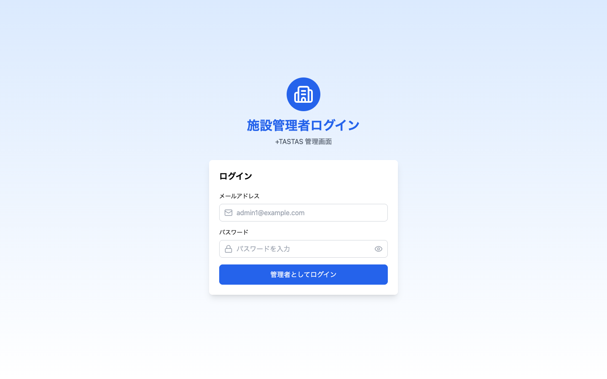
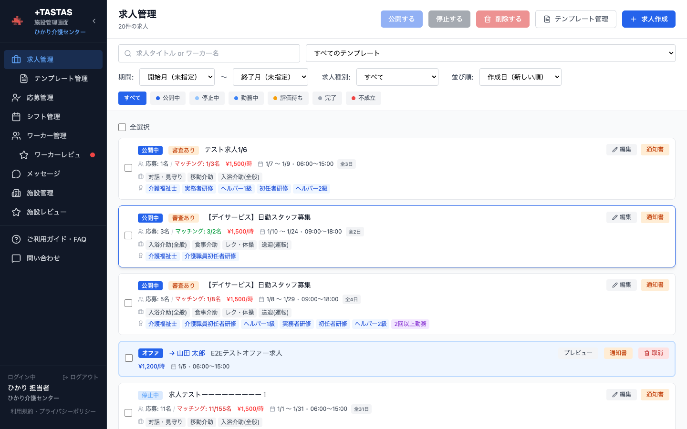
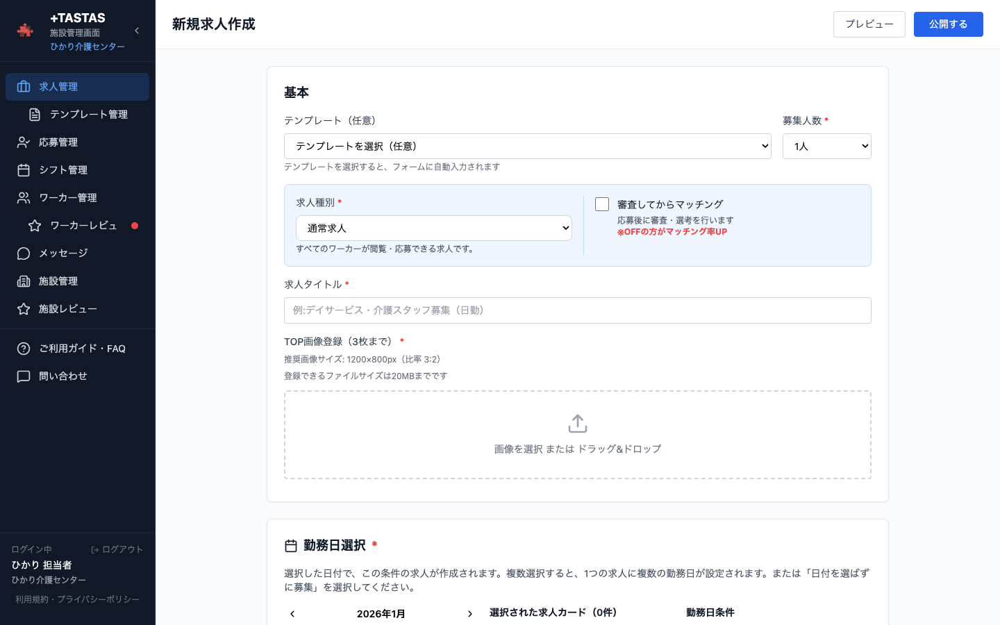
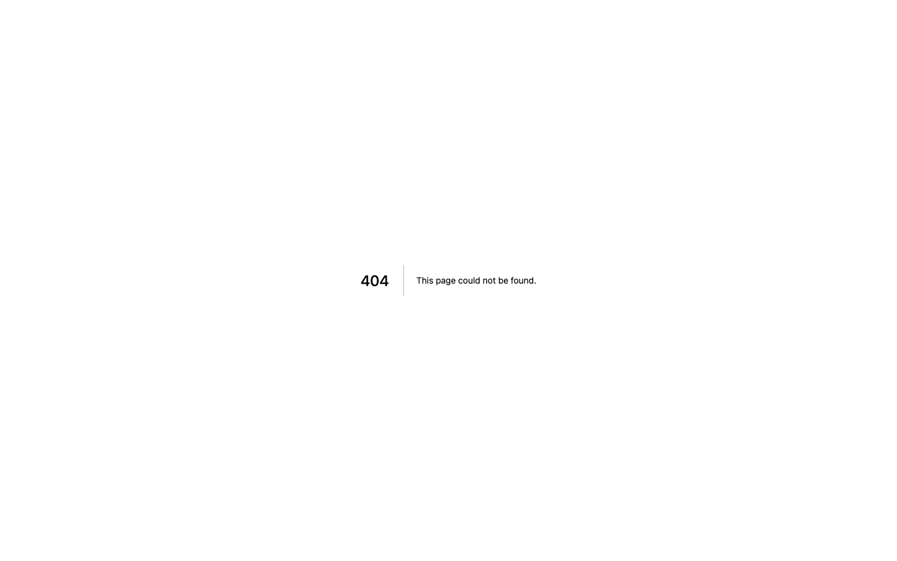
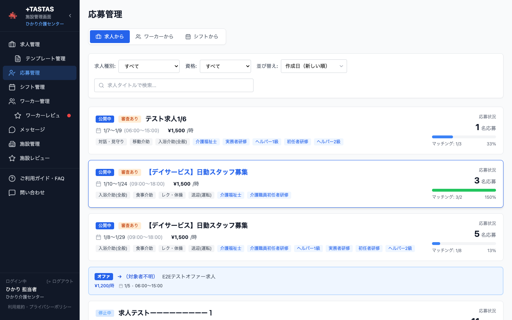
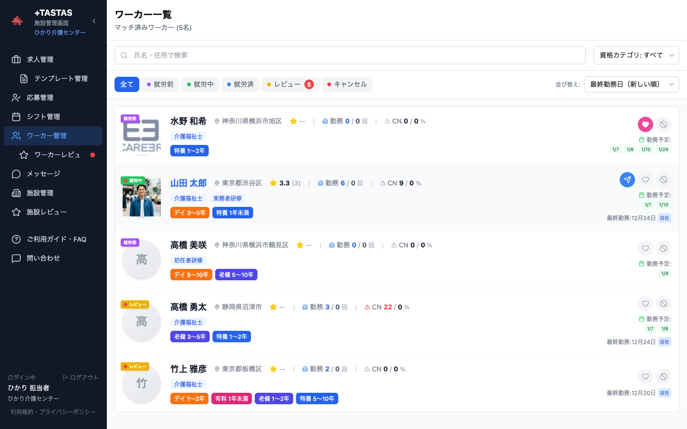
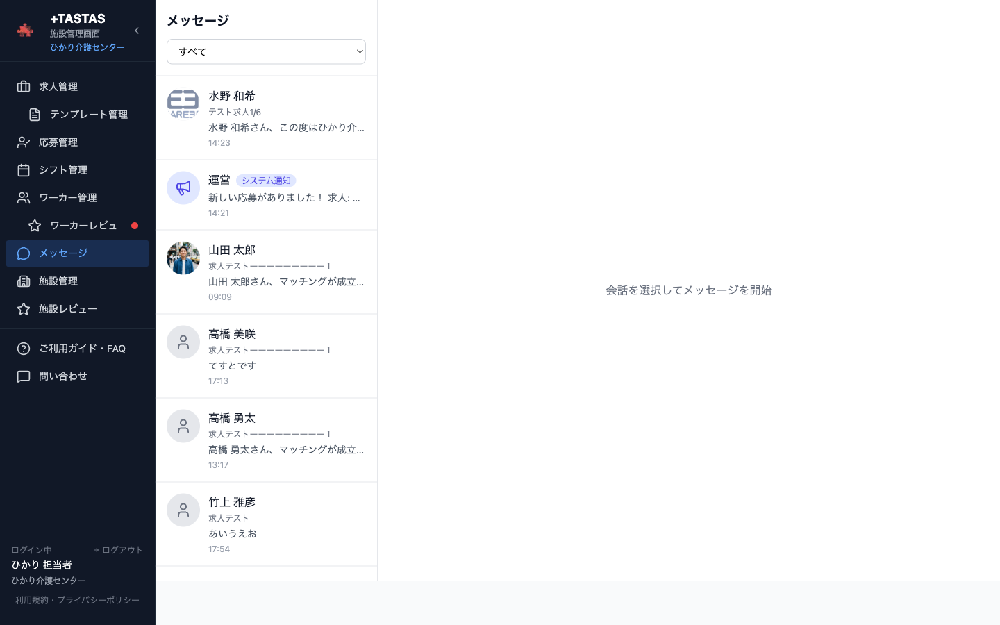
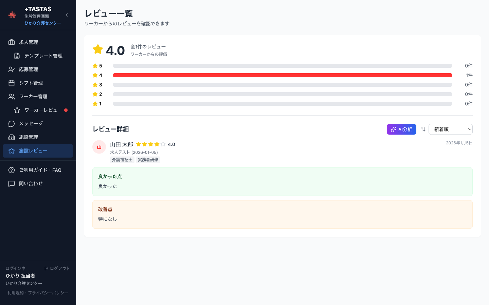
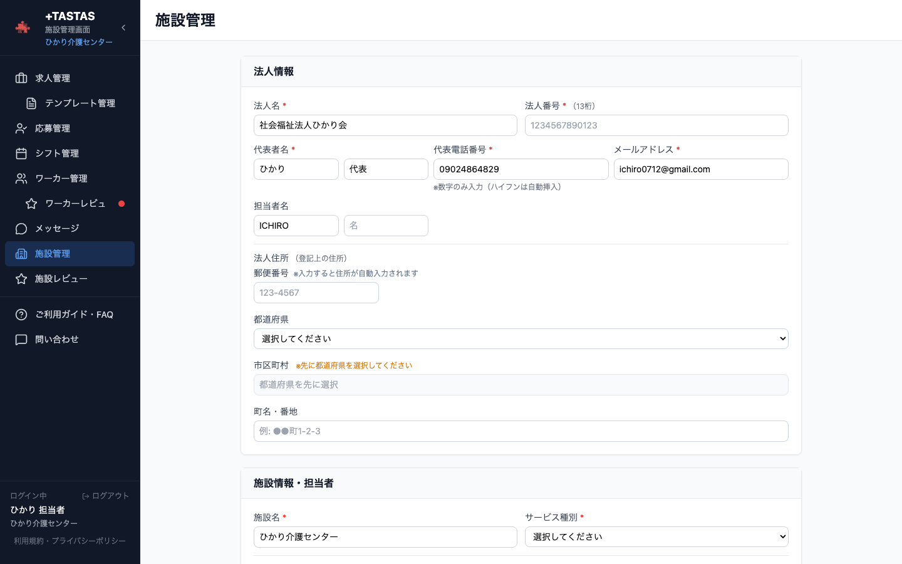

# +TASTAS 施設管理者向け操作マニュアル

> **更新日**: 2025-01-07
> **対象者**: 施設の採用担当者・管理者

---

## はじめに

+TASTAS（タスタス）は、看護師・介護士向けの求人マッチングサービスです。
このマニュアルでは、施設管理者向けの機能と操作方法を詳細に説明します。

---

## 目次

1. [ログイン・アカウント管理](#1-ログインアカウント管理)
2. [求人管理](#2-求人管理)
3. [応募者管理](#3-応募者管理)
4. [ワーカー管理](#4-ワーカー管理)
5. [メッセージ機能](#5-メッセージ機能)
6. [レビュー機能](#6-レビュー機能)
7. [施設情報の編集](#7-施設情報の編集)
8. [シフト管理](#8-シフト管理)
9. [通知について](#9-通知について)
10. [よくある質問](#10-よくある質問)

---

## 1. ログイン・アカウント管理

### 1.1 ログイン

1. `/admin/login` にアクセス
2. メールアドレスとパスワードを入力
3. 「ログイン」ボタンをクリック



### 1.2 パスワード変更

1. 施設情報ページにアクセス
2. 「パスワード変更」をクリック
3. 現在のパスワードと新しいパスワードを入力

### 1.3 パスワードを忘れた場合

1. ログイン画面の「パスワードを忘れた方」をクリック
2. 登録メールアドレスを入力
3. 届いたメールのリンクからパスワードを再設定

---

## 2. 求人管理

ログイン後はダッシュボードが表示されます。



### 2.1 求人一覧

サイドバーの「求人管理」をクリックすると、作成した求人一覧が表示されます。


**ステータス:**
| ステータス | 説明 |
|------------|------|
| 下書き | 作成中、未公開 |
| 公開中 | ワーカーに表示中 |
| 募集終了 | 締切済み |
| 完了 | 勤務完了 |

**フィルタリング:**
ドロップダウンで求人種別を絞り込めます：
- すべて
- 通常求人
- 限定（勤務実績あり）
- 限定（お気に入り）
- オファー
- 説明会

### 2.2 求人種別の詳細

+TASTASでは5種類の求人を作成できます。

| 種別 | 説明 | 対象者 | 応募受付 |
|------|------|--------|----------|
| **通常求人** | 一般公開の求人 | 全ワーカー | 全員から |
| **限定求人（勤務実績あり）** | 過去に勤務したワーカー限定 | 施設で勤務経験者（レビュー完了まで済んだ方） | 対象者のみ |
| **限定求人（お気に入り）** | お気に入り登録中のワーカー限定 | 施設がお気に入り登録したワーカー | 対象者のみ |
| **オファー** | 特定ワーカーへの指名求人 | 指名したワーカー1名 | 指名者のみ |
| **説明会** | 施設説明会・見学会 | 全ワーカー | 全員から |

#### 2.2.1 通常求人

最も基本的な求人タイプです。

- すべてのワーカーが閲覧・応募可能
- 「審査してからマッチング」のON/OFFを選択可能
- 募集人数を自由に設定可能

#### 2.2.2 限定求人（勤務実績あり）

過去に施設で勤務し、レビューまで完了したワーカーのみが対象です。

**対象者の条件:**
- その施設でマッチングし勤務を完了
- 双方のレビューが完了している（`completed_rated` ステータス）

**特徴:**
- 対象外のワーカーには一切表示されない
- 自動で通常求人に切り替える日数を設定可能
- 対象者が0人の場合は作成不可

**自動切り替え機能:**
応募が集まらない場合に備えて、勤務開始日のN日前に自動で通常求人に切り替えることができます。

| 勤務日までの日数 | デフォルト切り替え設定 |
|------------------|------------------------|
| 7日以上 | 7日前に切り替え |
| 3〜7日 | 3日前に切り替え |
| 1〜3日 | 1日前に切り替え |
| 1日未満 | 切り替えなし |

#### 2.2.3 限定求人（お気に入り）

施設がお気に入り登録しているワーカーのみが対象です。

**対象者の条件:**
- 施設がワーカー管理画面でお気に入り登録した方

**特徴:**
- 対象外のワーカーには一切表示されない
- お気に入りを解除すると、該当ワーカーには非表示になる
- 自動で通常求人に切り替える日数を設定可能
- お気に入りワーカーが0人の場合は作成不可

#### 2.2.4 オファー求人

特定のワーカー1名に対して専用の求人を作成します。

**オファーを送れる条件:**
- 過去に施設で勤務し、レビューまで完了したワーカーのみ

**オファーの特徴:**
| 項目 | 内容 |
|------|------|
| 募集人数 | 1名固定（変更不可） |
| マッチング方式 | 即時マッチング（審査なし） |
| 編集 | 作成後の編集不可 |
| 有効期限 | 応募締切日まで |
| メッセージ | オファー作成時にメッセージを添えられる |

**オファー作成の流れ:**
1. ワーカー管理画面でオファー対象者を選択
2. 「オファーを送る」ボタンをクリック
3. 求人内容を入力（通常の求人作成と同様）
4. メッセージ欄にオファーの理由や熱意を記入
5. 作成ボタンをクリック
6. ワーカーに自動でメッセージが送信される

**オファーの注意点:**
- 同じワーカーに同じ日程の重複オファーは不可
- 別日程へのオファーは可能
- ワーカーが応答しない場合は期限切れで自動終了
- 期限切れ後は再オファー可能

#### 2.2.5 説明会求人

施設の説明会や見学会の参加者を募集します。

**特徴:**
- 求人一覧・詳細に「説明会」バッジが表示される
- ワーカーは「説明会を除く」フィルターで除外可能
- 「審査してからマッチング」のON/OFFを選択可能

### 2.3 求人作成

#### 2.3.1 基本的な作成手順

1. 「新規作成」ボタンをクリック
2. 求人種別を選択（ラジオボタン）
3. 各項目を入力
4. 「公開」または「下書き保存」をクリック


<details>
<summary>全画面表示</summary>


</details>

#### 2.3.2 入力項目一覧

| カテゴリ | 項目 | 説明 |
|----------|------|------|
| **基本情報** | 求人タイトル | 求人の見出し（必須） |
| | 勤務時間 | 開始〜終了時間（必須） |
| | 休憩時間 | 分単位で入力 |
| **勤務日** | 日付選択 | カレンダーから選択（複数可） |
| | 日別募集人数 | 各日の募集人数を設定 |
| **報酬** | 時給 | 円単位で入力（必須） |
| | 日給 | 時給×勤務時間で自動計算 |
| | 交通費 | 上限金額を設定 |
| **締切設定** | 応募締切 | 勤務日の何日前まで応募可能か |
| | 募集開始日 | 求人を公開するタイミング |
| **業務内容** | 業務タグ | チェックボックスで選択 |
| | 詳細説明 | 具体的な業務内容を記述 |
| **資格要件** | 必要資格 | 看護師、介護福祉士など |
| **勤務条件** | 服装・持ち物 | 必要な服装や持ち物 |
| | 移動手段 | 車OK、駐車場ありなど |
| | こだわり条件 | 未経験歓迎、髪型自由など |
| **マッチング** | マッチング方式 | 即時 or 審査後 |
| | 通常求人切り替え | 限定求人のみ：N日前に切り替え |
| **担当者** | 責任者情報 | 担当者名、メッセージ、写真 |
| **画像** | 施設写真 | 施設・職場の写真をアップロード |

#### 2.3.3 マッチング方式の選択

**即時マッチング（デフォルト）:**
```
ワーカーが応募
    ↓
自動的にマッチング成立
    ↓
勤務予定に追加
```

- 迅速に人員確保したい場合に最適
- 応募があれば即座に枠が埋まる

**審査後マッチング:**
```
ワーカーが応募
    ↓
施設が応募者を確認
    ↓
「マッチング決定」または「不採用」を選択
    ↓
結果がワーカーに通知
```

- 「審査してからマッチング」にチェック
- 応募者を選考してから採用を決定
- プロフィール、経験、評価を確認してから判断可能

### 2.4 求人テンプレート

よく使う求人内容をテンプレートとして保存できます。



#### 2.4.1 テンプレート作成

1. サイドバーの「テンプレート」をクリック
2. 「新規作成」をクリック
3. テンプレート名と内容を入力
4. 保存

#### 2.4.2 テンプレート使用

1. 求人作成時に「テンプレートから作成」を選択
2. 使用するテンプレートを選択
3. 必要に応じて内容を編集
4. 公開または下書き保存

### 2.5 オファーテンプレート

オファー求人専用のメッセージテンプレートを管理できます。

#### 2.5.1 テンプレート作成

1. `/admin/settings/offer-templates` にアクセス
2. 「新規作成」をクリック
3. テンプレート名と本文を入力
4. 保存

#### 2.5.2 テンプレートの制限

| 項目 | 制限 |
|------|------|
| テンプレート数 | 最大20件 |
| 本文文字数 | 1000文字以内 |
| デフォルト設定 | 1件のみ |

#### 2.5.3 使用例

```
テンプレート名: リピーター向け
本文:
○○様

いつも当施設でのお仕事ありがとうございます。
前回のご勤務が大変好評でしたので、
ぜひまたお力をお借りしたくご連絡いたしました。

ご検討いただけますと幸いです。
```

### 2.6 求人の編集・削除・複製

#### 2.6.1 編集

1. 求人一覧から該当求人を選択
2. 「編集」ボタンをクリック
3. 内容を修正して保存

**注意:** オファー求人は編集できません。修正が必要な場合は削除して再作成してください。

#### 2.6.2 削除

1. 求人一覧から該当求人を選択
2. 「削除」ボタンをクリック
3. 確認ダイアログで「削除」を選択

**注意:** 応募者がいる求人は削除できません。

#### 2.6.3 複製

1. 求人詳細画面の「複製」ボタンをクリック
2. 求人内容がコピーされた新規作成画面が開く
3. 日付などを変更して保存

### 2.7 求人種別の変更ルール

| 変更パターン | 可否 |
|--------------|------|
| 通常求人 ↔ 限定求人 | ✅ 可能 |
| 通常求人 ↔ 説明会 | ✅ 可能 |
| 通常求人 ↔ オファー | ❌ 不可 |
| 限定求人 ↔ オファー | ❌ 不可 |
| 説明会 ↔ 限定求人 | ❌ 不可 |
| 説明会 ↔ オファー | ❌ 不可 |

---

## 3. 応募者管理

### 3.1 応募者一覧

サイドバーの「応募管理」をクリック。



**ビュー切り替え:**
- **求人から**: 求人ごとに応募者を確認
- **シフトから**: カレンダー形式で応募状況を確認

**フィルタリング:**
- 求人種別（すべて/通常/限定/オファー）
- ステータス（応募中/マッチング/完了など）

### 3.2 応募ステータスの詳細

応募は以下のステータスで管理されます。

```
APPLIED（応募中）
    ↓ 審査通過 or 即時マッチング
SCHEDULED（マッチング成立）
    ↓ 勤務開始
WORKING（勤務中）
    ↓ 勤務終了
COMPLETED_PENDING（勤務完了・レビュー待ち）
    ↓ 双方レビュー完了
COMPLETED_RATED（完了・評価済み）
```

**分岐パターン:**
| ステータス | 説明 | 遷移元 |
|------------|------|--------|
| APPLIED | 応募中（審査待ち） | 新規応募時 |
| SCHEDULED | マッチング成立 | APPLIED → 承認時 |
| WORKING | 現在勤務中 | SCHEDULED → 勤務開始時 |
| COMPLETED_PENDING | 勤務完了・レビュー待ち | WORKING → 勤務終了時 |
| COMPLETED_RATED | 完了・評価済み | 双方レビュー完了時 |
| REJECTED | 不採用 | APPLIED → 不採用時 |
| CANCELLED | キャンセル | APPLIED/SCHEDULED → キャンセル時 |

### 3.3 審査の確認（審査ありの場合）

「審査後マッチング」を設定した求人の場合：

1. 応募一覧から該当の応募を選択
2. ワーカーのプロフィールを確認
3. 「マッチング決定」または「不採用」を選択

**確認できる情報:**

| カテゴリ | 項目 |
|----------|------|
| 基本情報 | 氏名、年齢、性別、顔写真 |
| 資格 | 保有資格一覧、資格証明書 |
| 経験 | 経験年数、経験分野 |
| 自己PR | ワーカーの自己紹介文 |
| 勤務履歴 | 過去の勤務実績（当施設・他施設） |
| 評価 | 平均評価、レビュー詳細 |
| 信頼性 | キャンセル率、遅刻率 |

### 3.4 キャンセル

マッチング成立後にキャンセルが必要な場合：

1. 該当の応募を選択
2. 「キャンセル」ボタンをクリック
3. 確認ダイアログで「キャンセル」を選択

**キャンセルの記録:**
- 施設側からのキャンセルは `cancelled_by: FACILITY` として記録
- ワーカーに自動で通知が送信される

### 3.5 オファーへの応答状況

オファー求人の場合、以下の状態を確認できます：

| 状態 | 説明 |
|------|------|
| 提示中 | ワーカーがまだ応答していない |
| 受諾済み | ワーカーがオファーを受けた |
| 期限切れ | 期限内に応答がなかった |
| キャンセル | 施設側でキャンセルした |

---

## 4. ワーカー管理

### 4.1 ワーカー一覧

サイドバーの「ワーカー管理」をクリック。

過去に応募・勤務したワーカーの一覧が表示されます。



**フィルター:**
| フィルター | 説明 |
|------------|------|
| 職種 | 看護師、介護士など |
| 勤務ステータス | 全員/勤務済み/応募中など |
| お気に入り | お気に入り登録者のみ |
| 名前検索 | ワーカー名で検索 |

### 4.2 ワーカー詳細

ワーカーを選択すると詳細情報が表示されます。

**表示される情報:**

| カテゴリ | 項目 |
|----------|------|
| プロフィール | 氏名、年齢、性別、顔写真、自己PR |
| 資格 | 保有資格、資格証明書画像 |
| 経験 | 経験年数、得意分野 |
| 連絡先 | 電話番号、メールアドレス |
| 勤務履歴 | 当施設での勤務回数、日付一覧 |
| 評価一覧 | 過去に受けたレビュー詳細 |
| 統計 | キャンセル率、平均評価 |

### 4.3 お気に入り登録

優秀なワーカーをお気に入りに登録できます。

**登録方法:**
- ワーカー一覧：ハートアイコンをクリック
- ワーカー詳細：「お気に入りに追加」ボタン

**お気に入りの活用:**
| 機能 | 説明 |
|------|------|
| 限定求人 | お気に入りワーカー限定の求人を作成可能 |
| 絞り込み | お気に入りワーカーのみ表示 |
| 通知 | 新着求人をお気に入りワーカーに通知（将来機能） |

### 4.4 ブロック

問題のあるワーカーをブロックできます。

**ブロックの効果:**
- ブロックしたワーカーには施設の求人が表示されない
- メッセージのやり取りは継続可能（過去の勤務に関して）

**ブロック方法:**
1. ワーカー詳細画面を開く
2. 「ブロック」ボタンをクリック
3. 確認ダイアログで「ブロック」を選択

**ブロック解除:**
1. ワーカー詳細画面を開く
2. 「ブロック解除」ボタンをクリック

### 4.5 オファーを送る

勤務実績のあるワーカーに直接オファーを送れます。

**オファーボタンの表示条件:**
- 過去に施設で勤務し、レビューまで完了していること

**オファーの送り方:**

1. ワーカー詳細画面を開く
2. 「オファーを送る」ボタンをクリック
3. オファー求人作成画面が開く
4. 求人内容とメッセージを入力
5. 「オファーを送信」をクリック

**オファー作成時の注意:**
- 募集人数は1名固定
- マッチング方式は即時マッチング固定
- 同じワーカーに同じ日程の重複オファーは不可

---

## 5. メッセージ機能

### 5.1 メッセージ一覧

サイドバーの「メッセージ」をクリック。

ワーカーごとに会話がまとまって表示されます。



**一覧の情報:**
- ワーカー名・顔写真
- 最新メッセージの抜粋
- 未読バッジ
- 最終更新日時

### 5.2 メッセージ送信

1. ワーカーを選択
2. チャット画面が開く
3. メッセージを入力
4. 「送信」をクリック

### 5.3 添付ファイル

メッセージに添付ファイルを送信できます。

**対応形式:**
| カテゴリ | 形式 |
|----------|------|
| 画像 | jpg, png, gif, webp など |
| 文書 | pdf, doc, docx, xlsx など |

**制限:**
- 1ファイル最大: 15MB
- 同時添付: 最大3ファイル

### 5.4 自動メッセージ

以下のタイミングで運営から自動メッセージが送信されます：

| タイミング | 内容 |
|------------|------|
| マッチング成立時 | 勤務確定のお知らせ、労働条件通知書の案内 |
| 勤務前日 | リマインドメッセージ |
| 勤務完了後 | レビュー依頼 |
| オファー送信時 | オファー内容とメッセージ |

### 5.5 メッセージの活用例

**勤務前の連絡:**
```
○○様

明日の勤務について確認事項がございます。
・集合場所: 正面玄関
・持ち物: 上履き、印鑑
・服装: 白衣をご持参ください

よろしくお願いいたします。
```

**勤務後のお礼:**
```
○○様

本日はお忙しい中ご勤務いただき
誠にありがとうございました。

スタッフ一同、大変助かりました。
またのご応募をお待ちしております。
```

---

## 6. レビュー機能

サイドバーの「レビュー」からレビュー管理画面にアクセスできます。



### 6.1 ワーカーへのレビュー投稿

勤務完了後、ワーカーを評価できます。

**投稿タイミング:**
- ワーカーの勤務が完了（`COMPLETED_PENDING`）になった後

**投稿方法:**
1. ワーカー詳細画面の「レビューを書く」をクリック
2. 評価項目を入力
3. 送信

### 6.2 評価項目

| 項目 | 説明 | 評価方法 |
|------|------|----------|
| 総合評価 | 全体的な評価 | ★1〜5 |
| 出勤・時間厳守 | 時間を守れたか | ★1〜5 |
| スキル・技術 | 業務スキル | ★1〜5 |
| 業務遂行力 | 指示通りに業務をこなせたか | ★1〜5 |
| コミュニケーション | 報連相ができたか | ★1〜5 |
| 勤務態度 | 積極性・姿勢 | ★1〜5 |
| 良かった点 | 自由記述 | テキスト |
| 改善点 | 自由記述 | テキスト |

### 6.3 レビューテンプレート

よく使う評価文をテンプレートとして保存できます。

**作成方法:**
1. ワーカーレビュー画面でテンプレート管理を開く
2. 「新規作成」をクリック
3. テンプレート名と内容を入力
4. 保存

**テンプレート例:**
```
テンプレート名: 優秀スタッフ
良かった点:
とても丁寧な対応で、入居者様からも好評でした。
コミュニケーションも円滑で、また是非お願いしたいと思います。
```

### 6.4 ワーカーからのレビュー確認

ワーカーからのレビューは「施設レビュー」で確認できます。

**確認できる項目:**
- 総合評価（★1〜5）
- 良かった点
- 改善点

### 6.5 レビューの注意点

| ルール | 説明 |
|--------|------|
| 投稿条件 | 勤務が完了していること |
| 重複投稿 | 同じ勤務に対して1回のみ |
| 編集 | 投稿後の編集不可（削除して再投稿は可能） |

---

## 7. 施設情報の編集

### 7.1 基本情報

サイドバーの「法人・施設」をクリック。



<details>
<summary>全画面表示</summary>


</details>

**編集可能な項目:**

| カテゴリ | 項目 | 説明 |
|----------|------|------|
| 法人情報 | 法人名 | 運営法人名 |
| | 法人番号 | 13桁の法人番号 |
| 施設情報 | 施設名 | 施設の名称 |
| | 施設種別 | 特養、老健、デイサービスなど |
| | 電話番号 | 連絡先電話番号 |
| 住所 | 郵便番号 | 7桁（ハイフンなし可） |
| | 都道府県 | ドロップダウンから選択 |
| | 市区町村 | テキスト入力 |
| | 番地以降 | テキスト入力 |
| 担当者 | 担当者名 | 採用担当者名 |
| | 担当者メール | 通知先メールアドレス |
| 紹介文 | 挨拶文 | 施設紹介文（180文字まで） |

### 7.2 画像の設定

以下の画像をアップロードできます：

| 画像種類 | 説明 | 推奨サイズ |
|----------|------|------------|
| 施設外観 | 建物の外観写真 | 1200×800px |
| 施設内部 | 職場環境の写真 | 1200×800px |
| 担当者写真 | 採用担当者の顔写真 | 400×400px |

### 7.3 地図の更新

住所を変更した場合、地図は自動で更新されます。

**手動更新:**
「地図画像を更新」ボタンをクリックで手動更新可能。

**注意:** マップピンの位置を微調整したい場合は、運営サポートまでお問い合わせください。

### 7.4 アカウント管理

施設に複数の担当者がいる場合は、追加アカウントの作成を運営にご依頼ください。

---

## 8. シフト管理

### 8.1 シフトビュー

応募管理画面で「シフトから」タブを選択すると、カレンダー形式で確認できます。

**表示切り替え:**
- 週表示: 1週間単位で表示
- 月表示: 1ヶ月単位で表示

### 8.2 シフトの見方

| 表示 | 意味 |
|------|------|
| 青バー | 募集中の求人 |
| 緑バー | マッチング成立 |
| グレーバー | 募集終了 |
| 赤バー | キャンセル発生 |

### 8.3 シフトからの操作

求人バーをクリックすると詳細モーダルが開き、以下の操作が可能です：

- 応募者の確認
- マッチング決定/不採用
- キャンセル処理
- 求人詳細への遷移

---

## 9. 通知について

### 9.1 通知の種類

| 通知 | タイミング | 通知方法 |
|------|------------|----------|
| 新規応募 | ワーカーが応募した時 | Push/メール |
| ワーカーキャンセル | ワーカーが予約をキャンセルした時 | Push/メール |
| 新着メッセージ | ワーカーからメッセージが届いた時 | Push |
| 勤務リマインド | 勤務前日 | Push/メール |
| レビュー依頼 | 勤務完了後 | Push |
| 募集枠充足 | 募集人数に達した時 | Push |
| 締切間近 | 応募が少ない求人の締切が近い時 | Push |
| オファー受諾 | ワーカーがオファーを受けた時 | Push/メール |

### 9.2 通知の受け取り方

**メール通知:**
- 登録メールアドレスに送信

**プッシュ通知:**
- ブラウザのプッシュ通知を許可してください

**設定方法:**
1. ブラウザからアクセス
2. 通知許可のダイアログで「許可」を選択

---

## 10. よくある質問

### 求人について

#### Q. 求人を複製したい

**A.** 求人詳細画面の「複製」ボタンを使用するか、テンプレート機能を活用してください。

#### Q. 応募が来ない

**A.** 以下を確認してください：
- 時給が相場より低くないか
- 募集期間が短すぎないか
- 求人タイトルが魅力的か
- 必要資格や条件が厳しすぎないか

#### Q. 限定求人の対象者が0人で作成できない

**A.** 対象者が0人の場合、限定求人は作成できません。以下をお試しください：
- 通常求人として作成する
- ワーカーをお気に入りに登録してから限定求人を作成する
- 過去の勤務実績がある場合は、レビューを完了させる

### オファーについて

#### Q. 特定のワーカーにだけ求人を出したい

**A.** 「オファー求人」機能を使用してください。ワーカー詳細画面から「オファーを送る」で作成できます。

**注意:** オファーは勤務実績（レビュー完了まで）があるワーカーのみに送信可能です。

#### Q. オファーボタンが表示されない

**A.** 以下の条件を満たしているか確認してください：
- 対象ワーカーが過去に施設で勤務している
- 勤務後のレビューが双方で完了している

#### Q. オファーを修正したい

**A.** オファー求人は作成後の編集ができません。修正が必要な場合は、オファーを削除して新規作成してください。

### 応募者について

#### Q. 応募者のキャンセル率はどこで確認できますか？

**A.** ワーカー詳細画面で確認できます。マッチング成立後にキャンセルした割合が表示されます。

#### Q. 過去に勤務したワーカーだけに求人を出したい

**A.** 求人作成時に求人種別を「限定求人（勤務実績あり）」に設定してください。

### アカウントについて

#### Q. 複数の担当者でアカウントを共有できますか？

**A.** セキュリティ上、アカウントの共有は推奨しません。複数担当者が必要な場合は運営までご相談ください。

#### Q. 退会したい

**A.** 運営サポートまでお問い合わせください。未完了の予約がある場合は先にキャンセルしてください。

---

## お問い合わせ

ご不明な点がございましたら、以下までご連絡ください。

- **メール**: support@tastas.jp
- **営業時間**: 平日 9:00〜18:00

---

*最終更新: 2025年1月7日*
