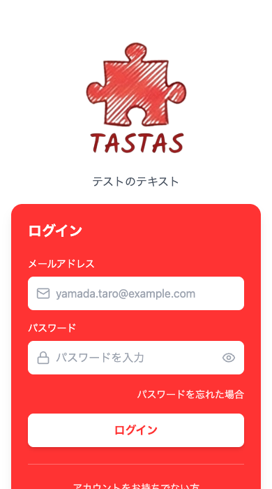
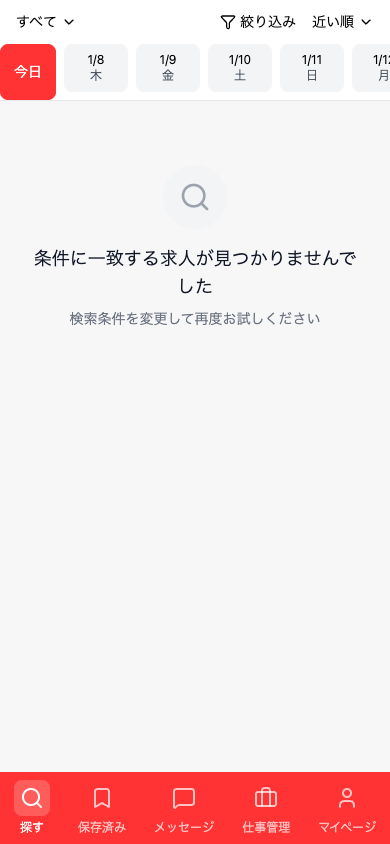
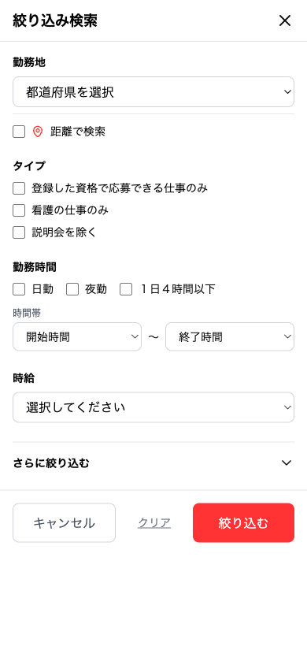
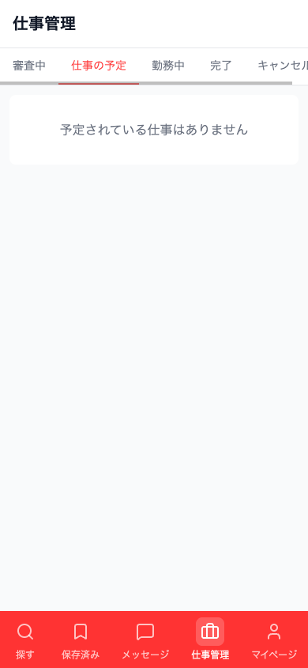
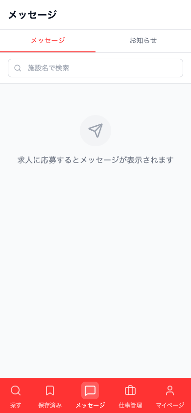
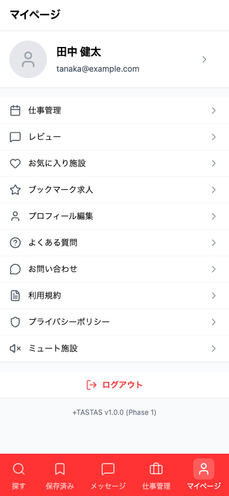
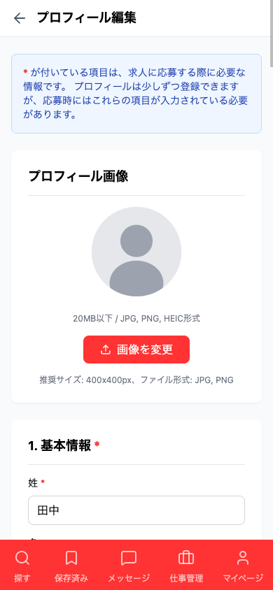
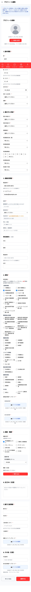
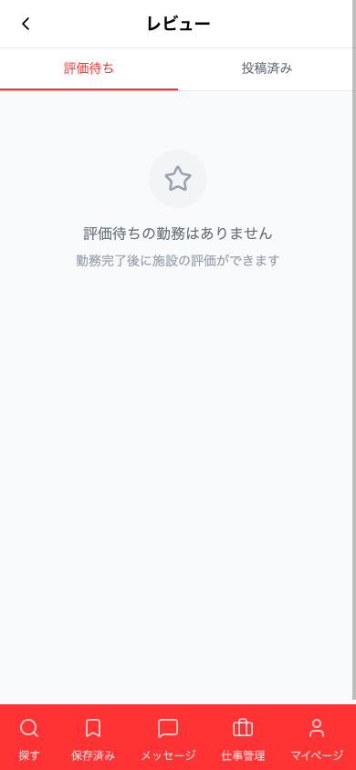
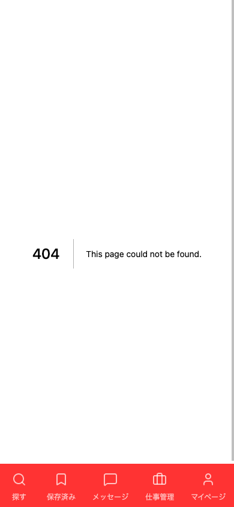

# +タスタス ワーカー向け操作マニュアル

> **更新日**: 2025-01-07
> **対象者**: 看護師・介護士などの求職者

---

## はじめに

+タスタス（タスタス）は、看護師・介護士向けの求人マッチングサービスです。
単発・短期のお仕事を中心に、働きたい日時で柔軟にお仕事を探すことができます。

---

## 目次

1. [会員登録・ログイン](#1-会員登録ログイン)
2. [お仕事を探す](#2-お仕事を探す)
3. [お仕事に応募する](#3-お仕事に応募する)
4. [お仕事の管理](#4-お仕事の管理)
5. [メッセージ機能](#5-メッセージ機能)
6. [マイページ](#6-マイページ)
7. [便利な機能](#7-便利な機能)
8. [通知について](#8-通知について)
9. [よくある質問](#9-よくある質問)

---

## 1. 会員登録・ログイン

### 1.1 新規会員登録

1. トップページの「新規登録」をタップ
2. メールアドレス、パスワードを入力
3. 基本情報（氏名、生年月日など）を入力
4. 保有資格を選択
5. 資格証明書の画像をアップロード
6. 登録完了

**必要な情報:**

| カテゴリ | 項目 |
|----------|------|
| 認証情報 | メールアドレス（ログインに使用）、パスワード（8文字以上） |
| 基本情報 | 氏名・フリガナ、生年月日、性別 |
| 連絡先 | 電話番号、住所 |
| 資格 | 保有資格、資格証明書の画像 |

### 1.2 ログイン

1. トップページの「ログイン」をタップ
2. メールアドレスとパスワードを入力
3. 「ログイン」ボタンをタップ



### 1.3 パスワードを忘れた場合

1. ログイン画面の「パスワードを忘れた方」をタップ
2. 登録メールアドレスを入力
3. 届いたメールのリンクからパスワードを再設定

---

## 2. お仕事を探す

### 2.1 求人一覧の見方

トップページに求人一覧が表示されます。



**求人カードの情報:**

| 項目 | 説明 |
|------|------|
| 施設名・評価 | 施設名と★評価 |
| 求人タイトル | お仕事の内容 |
| 勤務日時 | 勤務日と時間帯 |
| 日給・時給 | 報酬額 |
| 応募締切 | 応募できる期限 |
| 施設種別タグ | 特養、老健、デイサービスなど |
| バッジ | 求人の特徴（詳細は下記参照） |

### 2.2 求人のバッジについて

求人には以下のバッジが表示されることがあります：

| バッジ | 意味 |
|--------|------|
| **限定** | 勤務実績のあるワーカー限定の求人 |
| **限定★** | お気に入り登録されているワーカー限定の求人 |
| **オファー** | あなた宛ての指名求人 |
| **説明会** | 施設の説明会・見学会 |
| **審査あり** | 応募後に施設が審査を行う求人 |
| **未経験歓迎** | 未経験でもOKな求人 |

### 2.3 求人の種類

+タスタスには複数の求人タイプがあります。

**求人リストの切り替え:**
画面上部のドロップダウンで表示する求人を切り替えられます。

| 選択肢 | 表示される求人 |
|--------|----------------|
| すべて | 通常求人・説明会（限定・オファーは含まない） |
| 限定求人 | あなたが対象の限定求人のみ |
| オファー | あなた宛てのオファーのみ |

#### 2.3.1 通常求人

すべてのワーカーが閲覧・応募できる一般的な求人です。

#### 2.3.2 限定求人

特定の条件を満たすワーカーのみが閲覧・応募できる求人です。

**限定求人（勤務実績あり）:**
- 過去にその施設で勤務し、レビューまで完了した方のみ対象
- 施設からの信頼の証です
- 通常求人に比べて競争率が低いことが多い

**限定求人（お気に入り）:**
- 施設があなたをお気に入りに登録している場合のみ対象
- 施設から高く評価されている証拠です

#### 2.3.3 オファー求人

施設からあなた個人に送られる指名求人です。

**オファーの特徴:**
- 過去に勤務した施設からのみ届く
- あなた1人だけへの特別な求人
- 応募すれば即マッチング（審査なし）
- 有効期限があるので早めの確認を

**オファーの確認方法:**
1. 求人TOP で「オファー」を選択
2. あなた宛のオファー一覧が表示される
3. 求人詳細で内容を確認
4. 「オファーを受ける」で応募

#### 2.3.4 説明会求人

施設の説明会や見学会への参加募集です。

- 「説明会」バッジが表示される
- 検索時に「説明会を除く」フィルターで除外可能

### 2.4 検索・絞り込み

「絞り込み」ボタンをタップするとフィルターパネルが開きます。



**キーワード検索:**
- 画面上部の検索バーに入力
- 求人タイトル、施設名で検索可能

**フィルター条件:**

| 項目 | 説明 |
|------|------|
| エリア | 都道府県・市区町村で絞り込み |
| 勤務日 | 日付範囲を指定 |
| 時間帯 | 開始・終了時間で絞り込み |
| 時給 | 最低時給を指定 |
| 施設種別 | 特養、老健、デイサービスなど |
| 移動手段 | 車通勤OK、駐車場ありなど |
| こだわり | 未経験歓迎、髪型自由など |
| 説明会を除く | 説明会を検索結果から除外 |

**並べ替え:**
- 新着順
- 時給順（高い順）
- 締切順（近い順）
- 近い順（位置情報使用）

### 2.5 求人詳細の確認

求人カードをタップすると詳細画面が開きます。

**タブ構成:**

| タブ | 内容 |
|------|------|
| 概要 | 勤務日時、報酬、アクセス、地図 |
| 詳細 | 業務内容、必要資格、服装・持ち物 |
| 条件 | 移動手段、こだわり条件 |
| レビュー | 施設の評価・口コミ |

---

## 3. お仕事に応募する

### 3.1 応募の流れ

1. 求人詳細画面で「応募する」をタップ
2. 勤務希望日を選択（複数日ある場合）
3. 応募確認モーダルで内容を確認
4. 「応募する」をタップ

**オファー求人の場合:**
- ボタンが「オファーを受ける」になる
- タップすると即マッチング成立

### 3.2 マッチング方式

求人によって応募後の流れが異なります。

**即時マッチング:**
```
応募する
    ↓
自動的にマッチング成立
    ↓
「仕事の予定」に追加
```

**審査ありマッチング:**
```
応募する（「審査あり」バッジの求人）
    ↓
施設が審査（数日かかることも）
    ↓
結果がメッセージで通知
    ↓
承認されれば「仕事の予定」に追加
```

### 3.3 自己PRの重要性

応募時に自己PRが施設に送られます。設定していない場合は警告が表示されます。

**自己PRの設定方法:**
1. マイページ → プロフィール編集
2. 「自己PR」欄に記入
3. 保存

**効果的な自己PRの書き方:**
- 経験年数や得意分野を記載
- 特に力を入れてきたケアの内容
- 勤務可能な時間帯や曜日
- 意気込みや目標

**例:**
```
看護師として病棟勤務5年の経験があります。
高齢者看護が得意で、認知症ケアにも携わってきました。
土日祝日も勤務可能です。
丁寧な対応を心がけ、患者様・入居者様に
寄り添ったケアを提供いたします。
```

### 3.4 応募時の注意点

| 注意点 | 説明 |
|--------|------|
| ダブルブッキング | 同じ日時に複数の予定が重ならないように注意 |
| 締切確認 | 応募締切を過ぎると応募できない |
| 資格確認 | 必要資格を満たしているか確認 |
| 移動時間 | 施設への移動時間を考慮して応募 |

---

## 4. お仕事の管理

### 4.1 お仕事画面

画面下部のナビゲーションから「仕事」をタップ。



**タブ構成:**

| タブ | 内容 |
|------|------|
| 審査中 | 応募後、施設審査待ちのお仕事 |
| 仕事の予定 | マッチング成立、これから勤務するお仕事 |
| 勤務中 | 現在勤務中のお仕事 |
| 完了 | 勤務完了したお仕事 |
| キャンセル | キャンセルしたお仕事 |

### 4.2 ステータスの詳細

お仕事は以下のステータスで管理されます。

```
応募
  ↓
APPLIED（審査中）
  ↓ 承認 or 即時マッチング
SCHEDULED（マッチング成立）
  ↓ 勤務開始時刻
WORKING（勤務中）
  ↓ 勤務終了
COMPLETED_PENDING（完了・レビュー待ち）
  ↓ 双方レビュー完了
COMPLETED_RATED（完了・評価済み）
```

**分岐パターン:**

| 状況 | 結果ステータス |
|------|----------------|
| 審査で不採用 | REJECTED |
| 自分でキャンセル | CANCELLED |
| 施設がキャンセル | CANCELLED |
| 審査中に取り消し | 応募取消（キャンセル率に影響なし） |

### 4.3 応募取消（審査中のみ）

審査中のお仕事は取り消すことができます。

1. 「審査中」タブから該当のお仕事をタップ
2. 「応募取消」ボタンをタップ
3. 確認画面で「取り消す」をタップ

**重要:** 審査中の取り消しはキャンセル率に影響しません。

### 4.4 キャンセル（マッチング後）

マッチング成立後のキャンセルは以下の手順で行います。

1. 「仕事の予定」または「勤務中」タブから該当のお仕事をタップ
2. 「キャンセル」ボタンをタップ
3. 確認画面で「キャンセルする」をタップ

**重要な注意:**
| 項目 | 説明 |
|------|------|
| キャンセル率への影響 | マッチング後のキャンセルはキャンセル率に影響 |
| 施設への通知 | キャンセルすると施設に自動通知 |
| 信頼への影響 | キャンセル率は施設から確認できる |
| 推奨 | やむを得ない場合のみキャンセルしてください |

### 4.5 勤務当日の流れ

1. **出発前**
   - 持ち物・服装を確認
   - 集合場所・時間を再確認
   - 交通手段・ルートを確認

2. **到着時**
   - 指定の時間に施設に到着
   - 担当者に挨拶・本人確認

3. **勤務中**
   - 業務を遂行
   - 不明点は担当者に確認
   - 休憩時間を確認

4. **勤務終了後**
   - 担当者に終了報告
   - アプリで勤務完了を確認
   - レビューを投稿（任意）

---

## 5. メッセージ機能

### 5.1 メッセージ画面

画面下部のナビゲーションから「メッセージ」をタップ。



**画面構成:**
- 施設ごとに会話がまとまって表示
- 未読メッセージは数字バッジで表示
- 最新のメッセージが上に表示

### 5.2 メッセージの送受信

1. 施設を選択
2. チャット画面が開く
3. メッセージを入力して送信

**添付ファイル:**

| 種類 | 対応形式 |
|------|----------|
| 画像 | jpg, png, gif, webp など |
| 文書 | pdf, doc, xlsx など |

**制限:**
- 最大サイズ: 15MB/ファイル
- 最大3ファイルまで同時送信可能

### 5.3 運営からのお知らせ

運営からの自動メッセージも同じチャット画面に表示されます。

**自動メッセージの種類:**

| タイミング | 内容 |
|------------|------|
| マッチング成立時 | 勤務確定のお知らせ、労働条件通知書の案内 |
| 勤務前日 | リマインドメッセージ |
| 勤務完了後 | レビュー依頼 |
| オファー受信時 | 施設からのオファー内容 |

### 5.4 メッセージの活用例

**勤務前の質問:**
```
お世話になります。
明日の勤務について質問がございます。
持ち物に「動きやすい服装」とありますが、
ジャージでも問題ないでしょうか？
ご確認いただけますと幸いです。
```

**勤務後のお礼:**
```
本日はありがとうございました。
スタッフの皆様にも親切にしていただき、
とても働きやすい環境でした。
またご縁がありましたらよろしくお願いいたします。
```

---

## 6. マイページ

画面下部のナビゲーションから「マイページ」をタップ。



### 6.1 プロフィール編集

マイページ → プロフィール編集



<details>
<summary>全画面表示</summary>


</details>

**編集できる項目:**

| カテゴリ | 項目 |
|----------|------|
| 基本情報 | 氏名、カナ、性別、生年月日、電話番号、顔写真 |
| 住所 | 郵便番号、都道府県、市区町村、番地 |
| 緊急連絡先 | 氏名、続柄、電話番号 |
| 資格・経験 | 保有資格、経験分野、経験年数 |
| 希望条件 | 働き方、希望日数、希望時間帯 |
| その他 | 自己PR、銀行口座 |

### 6.2 顔写真の重要性

顔写真は施設が応募者を確認する重要な情報です。

**良い顔写真のポイント:**
- 顔がはっきり見える
- 明るい場所で撮影
- 清潔感のある服装
- 自然な表情

**避けるべき写真:**
- 顔が隠れている
- 暗すぎる/明るすぎる
- 他の人が写っている
- 加工しすぎている

### 6.3 資格情報の管理

**資格の追加:**
1. プロフィール編集 → 資格情報
2. 「資格を追加」をタップ
3. 資格名を選択
4. 資格証明書の画像をアップロード
5. 保存

**資格証明書の注意:**
- 氏名が読み取れること
- 有効期限内であること
- 資格名・番号が確認できること

### 6.4 レビュー管理

マイページ → レビュー管理からレビューを管理できます。



**投稿するレビュー:**
勤務完了後、施設へのレビューを投稿できます。

1. マイページ → レビュー管理
2. 未投稿のレビューを選択
3. 評価と感想を入力
4. 送信

**レビューの評価項目:**

| 項目 | 説明 |
|------|------|
| 総合評価 | ★1〜5 |
| 良かった点 | 自由記述 |
| 改善点 | 自由記述（任意） |

**受け取ったレビュー:**
施設からのレビューを確認できます。

マイページ → 受け取ったレビュー

**表示される情報:**
- 総合評価
- 各項目の評価（出勤・スキル・コミュニケーションなど）
- 良かった点
- 改善点

### 6.5 キャンセル率について

キャンセル率は施設が応募者を判断する重要な指標です。

**計算方法:**
```
キャンセル率 = マッチング後のキャンセル数 ÷ マッチング総数 × 100
```

**キャンセル率の影響:**

| キャンセル率 | 影響 |
|--------------|------|
| 0〜5% | 問題なし |
| 5〜10% | やや高め（審査で不利になる可能性） |
| 10%以上 | 高い（採用されにくくなる） |

**キャンセル率を下げるには:**
- 応募前に予定を十分確認する
- やむを得ない場合のみキャンセル
- 審査中であれば「応募取消」を使う（キャンセル率に影響しない）

### 6.6 その他のメニュー

| メニュー | 説明 |
|----------|------|
| お気に入り | お気に入り登録した施設一覧 |
| ブックマーク | 保存した求人一覧 |
| ミュート施設 | 非表示にした施設一覧 |
| 通知設定 | プッシュ通知のON/OFF |
| ログアウト | ログアウト |

---

## 7. 便利な機能

### 7.1 お気に入り登録

気になる施設をお気に入りに登録すると：



**メリット:**
- 施設の新着求人をすぐにチェックできる
- お気に入り施設限定の求人が表示される場合がある
- 施設があなたをお気に入り登録しやすくなる

**登録方法:**
- 求人詳細または施設詳細のハートアイコンをタップ

### 7.2 ブックマーク

気になる求人を保存できます。

**登録方法:**
- 求人カードまたは詳細画面のブックマークアイコンをタップ

**活用方法:**
- 複数の求人を比較検討したい時
- 後で応募したい求人をメモ
- 締切前にリマインドとして確認

### 7.3 ミュート

特定の施設の求人を非表示にできます。

**設定方法:**
- 求人詳細画面で「この施設の求人を非表示」を選択

**解除方法:**
- マイページ → ミュート施設 → 解除

**ミュートの効果:**
- 該当施設の求人が検索結果に表示されなくなる
- オファーも届かなくなる

### 7.4 施設への期待を伝える

施設をお気に入り登録することで、「この施設で働きたい」という意思表示になります。

施設がワーカーのお気に入り登録を確認できるため、限定求人やオファーの対象になりやすくなります。

---

## 8. 通知について

### 8.1 通知の種類

| 通知 | タイミング |
|------|------------|
| マッチング成立 | 応募が承認された時 |
| 審査結果 | 審査ありの求人で結果が出た時 |
| 新着メッセージ | 施設からメッセージが届いた時 |
| 勤務リマインド | 勤務前日・当日 |
| レビュー依頼 | 勤務完了後 |
| 施設キャンセル | 施設が予約をキャンセルした時 |
| オファー受信 | 施設からオファーが届いた時 |

### 8.2 プッシュ通知の設定

**iOS（iPhone）の場合:**
1. +タスタスをホーム画面に追加
2. ホーム画面からアプリを起動
3. 通知許可のダイアログで「許可」を選択

**Android の場合:**
1. ブラウザからアクセス
2. 通知許可のダイアログで「許可」を選択

**通知が届かない場合:**
1. ブラウザの設定で通知が許可されているか確認
2. 端末の設定でブラウザの通知がONか確認
3. アプリをホーム画面から起動しているか確認

---

## 9. よくある質問

### 応募について

#### Q. 応募後にキャンセルできますか？

**A.** はい、キャンセルできます。ただし、マッチング成立後のキャンセルはキャンセル率に影響します。審査中の「応募取消」はキャンセル率に影響しません。

#### Q. 複数の求人に同時に応募できますか？

**A.** はい、複数の求人に応募できます。ただし、同じ日時に複数の予定が重ならないようご注意ください。

#### Q. オファーが届いたのですが、どうすればいいですか？

**A.** 求人TOP画面で「オファー」を選択すると、あなた宛のオファー一覧が表示されます。内容を確認し、「オファーを受ける」をタップすると応募できます。オファーには有効期限があるので、早めの確認をおすすめします。

#### Q. 限定求人とは何ですか？

**A.** 過去に勤務実績のあるワーカーや、施設がお気に入り登録したワーカー限定の求人です。対象者のみが閲覧・応募できます。通常求人より競争率が低いことが多いです。

### キャンセルについて

#### Q. キャンセル率とは何ですか？

**A.** マッチング成立後にキャンセルした割合です。施設から確認できるため、キャンセル率が高いと採用されにくくなる場合があります。

#### Q. キャンセル率を下げるにはどうすればいいですか？

**A.** 以下を心がけてください：
- 応募前に予定を十分確認する
- やむを得ない場合のみキャンセルする
- 審査中であれば「応募取消」を使う（キャンセル率に影響しない）
- キャンセルせずに勤務を重ねれば、自然と率は下がります

### 報酬について

#### Q. 報酬の支払いはどうなりますか？

**A.** 勤務完了後、登録した銀行口座に振り込まれます。詳細は各施設の条件をご確認ください。

#### Q. 交通費は出ますか？

**A.** 求人ごとに異なります。求人詳細の「交通費」欄で上限金額を確認してください。

### 資格について

#### Q. 資格証明書を再アップロードしたい

**A.** マイページ → プロフィール編集 → 資格情報から再アップロードできます。

#### Q. 資格証明書がアップロードできない

**A.** 以下を確認してください：
- ファイル形式（jpg, png, pdf）
- ファイルサイズ（10MB以下）
- 画像が鮮明に読み取れるか

### アカウントについて

#### Q. パスワードを忘れました

**A.** ログイン画面の「パスワードを忘れた方」から再設定できます。

#### Q. 退会したい

**A.** マイページから退会手続きを行ってください。未完了の予約がある場合は先にキャンセルしてください。

#### Q. メールアドレスを変更したい

**A.** マイページ → プロフィール編集 → メールアドレスから変更できます。変更後は確認メールが届きます。

### その他

#### Q. 施設からの評価は他の施設にも見えますか？

**A.** はい、あなたの平均評価やレビュー内容は他の施設からも確認できます。これにより、良い評価を積み重ねることで、より良い条件の求人に採用されやすくなります。

#### Q. 通知が届かない

**A.** 以下を確認してください：
1. ブラウザの通知設定
2. 端末の通知設定
3. アプリをホーム画面から起動しているか

---

## お問い合わせ

ご不明な点がございましたら、アプリ内のお問い合わせフォームまたは以下までご連絡ください。

- **メール**: support@tastas.jp
- **営業時間**: 平日 9:00〜18:00

---

*最終更新: 2025年1月7日*
